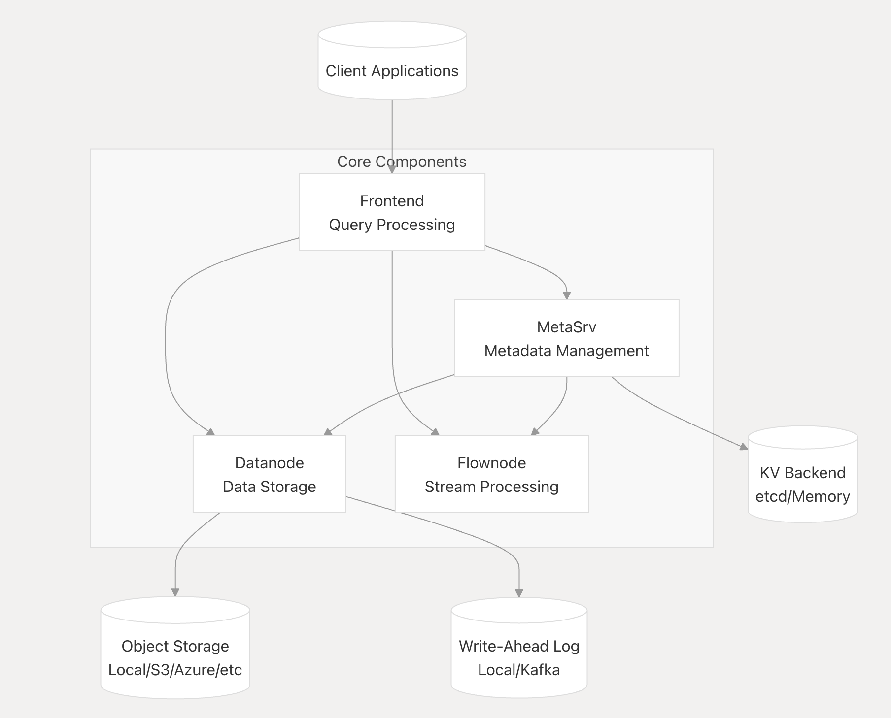

<p align="center">
  <picture>
    <source media="(prefers-color-scheme: light)" srcset="https://cdn.jsdelivr.net/gh/GreptimeTeam/greptimedb@main/docs/logo-text-padding.png">
    <source media="(prefers-color-scheme: dark)" srcset="https://cdn.jsdelivr.net/gh/GreptimeTeam/greptimedb@main/docs/logo-text-padding-dark.png">
    
  </picture>
</p>

<h2 align="center">Real-Time & Cloud-Native Observability  Database<br/>for metrics, logs, and traces</h2>

>  Delivers sub-second querying at PB scale and exceptional cost efficiency from edge to cloud.

<div align="center">
<h3 align="center">
  <a href="https://greptime.com/product/cloud">GreptimeCloud</a> |
  <a href="https://docs.greptime.com/">User Guide</a> |
  <a href="https://greptimedb.rs/">API Docs</a> |
  <a href="https://github.com/GreptimeTeam/greptimedb/issues/5446">Roadmap 2025</a>
</h4>

<a href="https://github.com/GreptimeTeam/greptimedb/releases/latest">

</a>
<a href="https://github.com/GreptimeTeam/greptimedb/releases/latest">

</a>
<a href="https://hub.docker.com/r/greptime/greptimedb/">

</a>
<a href="https://github.com/GreptimeTeam/greptimedb/actions/workflows/develop.yml">

</a>
<a href="https://codecov.io/gh/GrepTimeTeam/greptimedb">

</a>
<a href="https://github.com/greptimeTeam/greptimedb/blob/main/LICENSE">

</a>

<br/>

<a href="https://greptime.com/slack">

</a>
<a href="https://twitter.com/greptime">

</a>
<a href="https://www.linkedin.com/company/greptime/">

</a>
</div>

- [Introduction](#introduction)
- [⭐ Key Features](#features)
- [Quick Comparison](#quick-comparison)
- [Architecture](#architecture)
- [Try GreptimeDB](#try-greptimedb)
- [Getting Started](#getting-started)
- [Build From Source](#build-from-source)
- [Tools & Extensions](#tools--extensions)
- [Project Status](#project-status)
- [Community](#community)
- [License](#license)
- [Commercial Support](#commercial-support)
- [Contributing](#contributing)
- [Acknowledgement](#acknowledgement)

## Introduction

**GreptimeDB** is an open-source, cloud-native database purpose-built for the unified collection and analysis of observability data (metrics, logs, and traces). Whether you’re operating on the edge, in the cloud, or across hybrid environments, GreptimeDB empowers real-time insights at massive scale — all in one system.

## Features

|   Feature  | Description |
| --------- | ----------- |
| [Unified Observability Data](https://docs.greptime.com/user-guide/concepts/why-greptimedb) | Store metrics, logs, and traces as timestamped, contextual wide events. Query via [SQL](https://docs.greptime.com/user-guide/query-data/sql), [PromQL](https://docs.greptime.com/user-guide/query-data/promql), and [streaming](https://docs.greptime.com/user-guide/flow-computation/overview). |
| [High Performance & Cost Effective](https://docs.greptime.com/user-guide/manage-data/data-index) | Written in Rust, with a distributed query engine, [rich indexing](https://docs.greptime.com/user-guide/manage-data/data-index), and optimized columnar storage, delivering sub-second responses at PB scale. |
| [Cloud-Native Architecture](https://docs.greptime.com/user-guide/concepts/architecture) | Designed for [Kubernetes](https://docs.greptime.com/user-guide/deployments/deploy-on-kubernetes/greptimedb-operator-management), with compute/storage separation, native object storage (AWS S3, Azure Blob, etc.) and seamless cross-cloud access. |
| [Developer-Friendly](https://docs.greptime.com/user-guide/protocols/overview) | Access via SQL/PromQL interfaces, REST API, MySQL/PostgreSQL protocols, and popular ingestion [protocols](https://docs.greptime.com/user-guide/protocols/overview). |
| [Flexible Deployment](https://docs.greptime.com/user-guide/deployments/overview) | Deploy anywhere: edge (including ARM/[Android](https://docs.greptime.com/user-guide/deployments/run-on-android)) or cloud, with unified APIs and efficient data sync. |

Learn more in [Why GreptimeDB](https://docs.greptime.com/user-guide/concepts/why-greptimedb) and [Observability 2.0 and the Database for It](https://greptime.com/blogs/2025-04-25-greptimedb-observability2-new-database).

## Quick Comparison

| Feature                         | GreptimeDB            | Traditional TSDB   | Log Stores      |
|----------------------------------|-----------------------|--------------------|-----------------|
| Data Types                      | Metrics, Logs, Traces | Metrics only       | Logs only       |
| Query Language                  | SQL, PromQL, Streaming|  Custom/PromQL     | Custom/DSL      |
| Deployment                      | Edge + Cloud          | Cloud/On-prem      | Mostly central  |
| Indexing & Performance          | PB-Scale, Sub-second  | Varies             | Varies          |
| Integration                     | REST, SQL, Common protocols | Varies     | Varies          |

**Performance:**
* [GreptimeDB tops JSONBench's billion-record cold run test!](https://greptime.com/blogs/2025-03-18-jsonbench-greptimedb-performance)
* [TSBS Benchmark](https://github.com/GreptimeTeam/greptimedb/tree/main/docs/benchmarks/tsbs)

Read [more benchmark reports](https://docs.greptime.com/user-guide/concepts/features-that-you-concern#how-is-greptimedbs-performance-compared-to-other-solutions).

## Architecture

* Read the [architecture](https://docs.greptime.com/contributor-guide/overview/#architecture) document.
* [DeepWiki](https://deepwiki.com/GreptimeTeam/greptimedb/1-overview) provides an in-depth look at GreptimeDB:
  

## Try GreptimeDB

### 1. [Live Demo](https://greptime.com/playground)

Experience GreptimeDB directly in your browser.

### 2. [GreptimeCloud](https://console.greptime.cloud/)

Start instantly with a free cluster.

### 3. Docker (Local Quickstart)

```shell
docker pull greptime/greptimedb
```

```shell
docker run -p 127.0.0.1:4000-4003:4000-4003 \
  -v "$(pwd)/greptimedb_data:/greptimedb_data" \
  --name greptime --rm \
  greptime/greptimedb:latest standalone start \
  --http-addr 0.0.0.0:4000 \
  --rpc-bind-addr 0.0.0.0:4001 \
  --mysql-addr 0.0.0.0:4002 \
  --postgres-addr 0.0.0.0:4003
```
Dashboard: [http://localhost:4000/dashboard](http://localhost:4000/dashboard)
[Full Install Guide](https://docs.greptime.com/getting-started/installation/overview)

**Troubleshooting:**
* Cannot connect to the database? Ensure that ports `4000`, `4001`, `4002`, and `4003` are not blocked by a firewall or used by other services.
* Failed to start? Check the container logs with `docker logs greptime` for further details.

## Getting Started

- [Quickstart](https://docs.greptime.com/getting-started/quick-start)
- [User Guide](https://docs.greptime.com/user-guide/overview)
- [Demo Scenes](https://github.com/GreptimeTeam/demo-scene)
- [FAQ](https://docs.greptime.com/faq-and-others/faq)

## Build From Source

**Prerequisites:**
* [Rust toolchain](https://www.rust-lang.org/tools/install) (nightly)
* [Protobuf compiler](https://grpc.io/docs/protoc-installation/) (>= 3.15)
* C/C++ building essentials, including `gcc`/`g++`/`autoconf` and glibc library (eg. `libc6-dev` on Ubuntu and `glibc-devel` on Fedora)
* Python toolchain (optional): Required only if using some test scripts.

**Build and Run:**
```bash
make
cargo run -- standalone start
```

## Tools & Extensions

- **Kubernetes:** [GreptimeDB Operator](https://github.com/GrepTimeTeam/greptimedb-operator)
- **Helm Charts:** [Greptime Helm Charts](https://github.com/GreptimeTeam/helm-charts)
- **Dashboard:** [Web UI](https://github.com/GreptimeTeam/dashboard)
- **SDKs/Ingester:** [Go](https://github.com/GreptimeTeam/greptimedb-ingester-go), [Java](https://github.com/GreptimeTeam/greptimedb-ingester-java), [C++](https://github.com/GreptimeTeam/greptimedb-ingester-cpp), [Erlang](https://github.com/GreptimeTeam/greptimedb-ingester-erl), [Rust](https://github.com/GreptimeTeam/greptimedb-ingester-rust), [JS](https://github.com/GreptimeTeam/greptimedb-ingester-js)
- **Grafana**: [Official Dashboard](https://github.com/GreptimeTeam/greptimedb/blob/main/grafana/README.md)

## Project Status

> **Status:** Beta.
> **GA (v1.0):** Targeted for mid 2025.

- Being used in production by early adopters
- Stable, actively maintained, with regular releases ([version info](https://docs.greptime.com/nightly/reference/about-greptimedb-version))
- Suitable for evaluation and pilot deployments

For production use, we recommend using the latest stable release.
[](https://www.star-history.com/#GreptimeTeam/GreptimeDB&Date)

If you find this project useful, a ⭐ would mean a lot to us!


## Community

We invite you to engage and contribute!

- [Slack](https://greptime.com/slack)
- [Discussions](https://github.com/GreptimeTeam/greptimedb/discussions)
- [Official Website](https://greptime.com/)
- [Blog](https://greptime.com/blogs/)
- [LinkedIn](https://www.linkedin.com/company/greptime/)
- [Twitter](https://twitter.com/greptime)

## License

GreptimeDB is licensed under the [Apache License 2.0](https://apache.org/licenses/LICENSE-2.0.txt).

## Commercial Support

Running GreptimeDB in your organization?
We offer enterprise add-ons, services, training, and consulting.
[Contact us](https://greptime.com/contactus) for details.

## Contributing

- Read our [Contribution Guidelines](https://github.com/GreptimeTeam/greptimedb/blob/main/CONTRIBUTING.md).
- Explore [Internal Concepts](https://docs.greptime.com/contributor-guide/overview.html) and [DeepWiki](https://deepwiki.com/GreptimeTeam/greptimedb).
- Pick up a [good first issue](https://github.com/GreptimeTeam/greptimedb/issues?q=is%3Aissue+is%3Aopen+label%3A%22good+first+issue%22) and join the #contributors [Slack](https://greptime.com/slack) channel.

## Acknowledgement

Special thanks to all contributors! See [AUTHORS.md](https://github.com/GreptimeTeam/greptimedb/blob/main/AUTHOR.md).

- Uses [Apache Arrow™](https://arrow.apache.org/) (memory model)
- [Apache Parquet™](https://parquet.apache.org/) (file storage)
- [Apache Arrow DataFusion™](https://arrow.apache.org/datafusion/) (query engine)
- [Apache OpenDAL™](https://opendal.apache.org/) (data access abstraction)
