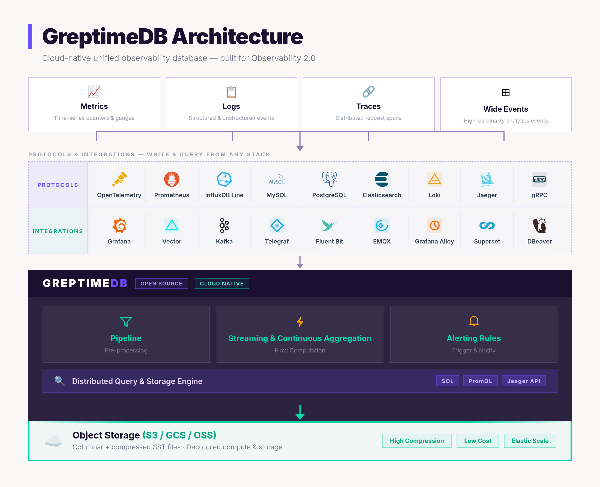
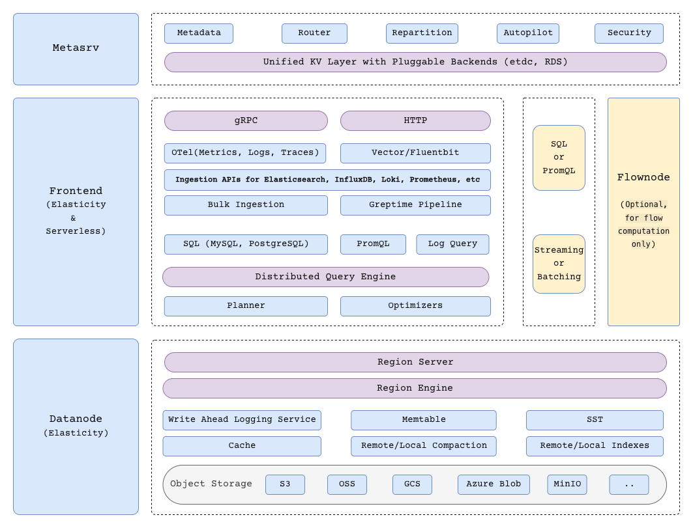

<p align="center">
  <picture>
    <source media="(prefers-color-scheme: light)" srcset="https://cdn.jsdelivr.net/gh/GreptimeTeam/greptimedb@main/docs/logo-text-padding.png">
    <source media="(prefers-color-scheme: dark)" srcset="https://cdn.jsdelivr.net/gh/GreptimeTeam/greptimedb@main/docs/logo-text-padding-dark.png">
    
  </picture>
</p>

<h2 align="center">One database for metrics, logs, and traces<br/>
replacing Prometheus, Loki, and Elasticsearch</h2>

> The unified OpenTelemetry backend — with SQL + PromQL on object storage.

<div align="center">
<h3 align="center">
  <a href="https://docs.greptime.com/user-guide/overview/">User Guide</a> |
  <a href="https://greptimedb.rs/">API Docs</a> |
  <a href="https://github.com/GreptimeTeam/greptimedb/issues/7685">Roadmap 2026</a>
</h3>

<a href="https://github.com/GreptimeTeam/greptimedb/releases/latest">

</a>
<a href="https://github.com/GreptimeTeam/greptimedb/releases/latest">

</a>
<a href="https://hub.docker.com/r/greptime/greptimedb/">

</a>
<a href="https://github.com/GreptimeTeam/greptimedb/actions/workflows/develop.yml">

</a>
<a href="https://codecov.io/gh/GreptimeTeam/greptimedb">

</a>
<a href="https://github.com/GreptimeTeam/greptimedb/blob/main/LICENSE">

</a>

<br/>

<a href="https://greptime.com/slack">

</a>
<a href="https://twitter.com/greptime">

</a>
<a href="https://www.linkedin.com/company/greptime/">

</a>
</div>

- [Introduction](#introduction)
- [Overview](#overview)
- [Features](#features)
- [How GreptimeDB Compares](#how-greptimedb-compares)
- [Architecture](#architecture)
- [Try GreptimeDB](#try-greptimedb)
- [Getting Started](#getting-started)
- [Build From Source](#build-from-source)
- [Tools & Extensions](#tools--extensions)
- [Project Status](#project-status)
- [Community](#community)
- [License](#license)
- [Commercial Support](#commercial-support)
- [Contributing](#contributing)
- [Acknowledgement](#acknowledgement)

## Introduction

**GreptimeDB** is an open-source observability database built for [Observability 2.0](https://docs.greptime.com/user-guide/concepts/observability-2/) — treating metrics, logs, and traces as one unified data model (wide events) instead of three separate pillars.

Use it as the single OpenTelemetry backend — replacing Prometheus, Loki, and Elasticsearch with one database built on object storage. Query with SQL and PromQL, scale without pain, cut costs up to 50×.

## Overview

A quick overview of what GreptimeDB ingests, how it connects to other systems, and what its distributed engine lets you do.

<p align="center">
  <a href="https://github.com/GreptimeTeam/greptimedb/raw/main/docs/overview.png" target="_blank" rel="noopener">
    
  </a>
</p>

## Features

| Feature | Description |
|---------|-------------|
| **Observability 2.0 native** | Logs, metrics, and traces in one engine with [SQL + PromQL](https://docs.greptime.com/user-guide/query-data/sql). Native [OpenTelemetry](https://docs.greptime.com/user-guide/ingest-data/for-observability/opentelemetry/), [Prometheus remote write](https://docs.greptime.com/user-guide/ingest-data/for-observability/prometheus/), and [Jaeger](https://docs.greptime.com/user-guide/query-data/jaeger/). Migrate one signal at a time, or use as a single backend. |
| **Elastic compute-storage separation** | Scale reads independently with horizontal replicas. Serve high-concurrency workloads from dashboards, alerting, and AI agents — without resharding or data migration. |
| **Sub-second on PB–EB-scale data** | Columnar engine with [fulltext, inverted, and skipping indexes](https://docs.greptime.com/user-guide/manage-data/data-index). Written in Rust. Designed for high-concurrency point queries, not just analytical scans. |
| **50× lower cost** | Object storage (S3, GCS, Azure Blob) as [primary storage](https://docs.greptime.com/user-guide/deployments-administration/configuration/#storage-options), with a tiered cache (memory + local disk) to keep writes and queries fast. |

**Perfect for:**
  * Replacing Prometheus + Loki + Elasticsearch with a single observability backend
  * Scaling past Prometheus — high cardinality, long-term storage, no Thanos/Mimir overhead
  * AI/agent workloads — store GenAI telemetry ([OTel GenAI conventions](https://opentelemetry.io/docs/specs/semconv/gen-ai/)), and serve high-concurrency reads from SRE/developer agents via horizontal read replicas
  * Cutting observability costs with object storage (up to 50× savings on traces, 30% on logs)
  * Edge-to-cloud observability with unified APIs on resource-constrained devices

> **Why Observability 2.0?** Three separate databases for metrics, logs, and traces means three storage layers, three query languages, and three sets of dashboards. GreptimeDB stores all three as timestamped wide events in one columnar engine — JOIN across signals in SQL, run one stack instead of three, and ingest AI agent telemetry the same way. Read more: [Observability 2.0 and the Database for It](https://greptime.com/blogs/2025-04-25-greptimedb-observability2-new-database).

Learn more in [Why GreptimeDB](https://docs.greptime.com/user-guide/concepts/why-greptimedb).

## How GreptimeDB Compares

| Capability | GreptimeDB | Prometheus / Thanos / Mimir | Grafana Loki | Elasticsearch |
|---|---|---|---|---|
| Data types | Metrics, logs, traces | Metrics only | Logs only | Logs, traces |
| Query language | SQL + PromQL | PromQL | LogQL | Query DSL |
| Storage | Native object storage (S3, etc.) | Local disk + object storage (Thanos/Mimir) | Object storage (chunks) | Local disk |
| Scaling | Compute-storage separation, stateless nodes | Federation / Thanos / Mimir — multi-component, ops heavy | Stateless + object storage | Shard-based, ops heavy |
| Cost efficiency | Up to 50× lower storage cost | High at scale | Moderate | High (inverted index overhead) |
| OpenTelemetry | Native (metrics + logs + traces) | Partial (metrics only) | Partial (logs only) | Via instrumentation |

**Benchmarks:**
* [GreptimeDB tops JSONBench's billion-record cold run test](https://greptime.com/blogs/2025-03-18-jsonbench-greptimedb-performance)
* [TSBS Benchmark](https://github.com/GreptimeTeam/greptimedb/tree/main/docs/benchmarks/tsbs)
* [More benchmark reports](https://docs.greptime.com/user-guide/concepts/features-that-you-concern#how-is-greptimedbs-performance-compared-to-other-solutions)

## Architecture

GreptimeDB can run in two modes:
* **Standalone** — single binary for development and small deployments.
* **Distributed** — four components, each independently scalable:
  - **Frontend** — protocol entry (OTel, Prometheus, MySQL/PostgreSQL, gRPC, ingestion APIs for Elasticsearch/InfluxDB/Loki) and the distributed query engine. Stateless, scales horizontally.
  - **Datanode** — region engine with WAL, memtable, SST, cache, compaction, and indexes. Persists data to object storage. Elastic.
  - **Metasrv** — metadata, routing, repartitioning, autopilot, and security. Backed by a pluggable KV layer (etcd or RDS).
  - **Flownode** (optional) — continuous flow computation (streaming and materialized views).

For deeper coverage, see the [architecture doc](https://docs.greptime.com/contributor-guide/overview/#architecture) or [DeepWiki](https://deepwiki.com/GreptimeTeam/greptimedb/1-overview).

<a href="https://github.com/GreptimeTeam/greptimedb/raw/main/docs/architecture.png" target="_blank" rel="noopener">
  
</a>

## Try GreptimeDB

```shell
docker run -p 127.0.0.1:4000-4003:4000-4003 \
  -v "$(pwd)/greptimedb_data:/greptimedb_data" \
  --name greptime --rm \
  greptime/greptimedb:latest standalone start \
  --http-addr 0.0.0.0:4000 \
  --rpc-bind-addr 0.0.0.0:4001 \
  --mysql-addr 0.0.0.0:4002 \
  --postgres-addr 0.0.0.0:4003
```
Dashboard: [http://localhost:4000/dashboard](http://localhost:4000/dashboard)

Read more in the [full Install Guide](https://docs.greptime.com/getting-started/installation/overview).

**Troubleshooting:**
* Cannot connect to the database? Ensure that ports `4000`, `4001`, `4002`, and `4003` are not blocked by a firewall or used by other services.
* Failed to start? Check the container logs with `docker logs greptime` for further details.

## Getting Started

- [Quickstart](https://docs.greptime.com/getting-started/quick-start)
- [User Guide](https://docs.greptime.com/user-guide/overview)
- [Demo Scenes](https://github.com/GreptimeTeam/demo-scene)
- [FAQ](https://docs.greptime.com/faq-and-others/faq)

## Build From Source

**Prerequisites:**
* [Rust toolchain](https://www.rust-lang.org/tools/install) — nightly, pinned by [`rust-toolchain.toml`](https://github.com/GreptimeTeam/greptimedb/blob/main/rust-toolchain.toml)
* [Protobuf compiler](https://grpc.io/docs/protoc-installation/) (>= 3.15)
* C/C++ building essentials: `gcc` / `g++` / `autoconf` and the glibc dev package (`libc6-dev` on Ubuntu, `glibc-devel` on Fedora)
* Python toolchain (optional, only for some test scripts)

**Build and run:**
```bash
make                          # build greptime binary
cargo run -- standalone start # start in standalone mode
```

**Common dev commands:**
```bash
make fmt            # format Rust code
make clippy         # lint (fails on warnings)
make test           # unit + integration tests (uses cargo-nextest)
make sqlness-test   # SQL regression tests
```

See the [Contribution Guidelines](https://github.com/GreptimeTeam/greptimedb/blob/main/CONTRIBUTING.md) for the full developer workflow.

## Tools & Extensions

- **Kubernetes**: [GreptimeDB Operator](https://github.com/GreptimeTeam/greptimedb-operator)
- **Helm Charts**: [Greptime Helm Charts](https://github.com/GreptimeTeam/helm-charts)
- **Dashboard**: [Web UI](https://github.com/GreptimeTeam/dashboard)
- **gRPC Ingester**: [Go](https://github.com/GreptimeTeam/greptimedb-ingester-go), [Java](https://github.com/GreptimeTeam/greptimedb-ingester-java), [C++](https://github.com/GreptimeTeam/greptimedb-ingester-cpp), [Erlang](https://github.com/GreptimeTeam/greptimedb-ingester-erl), [Rust](https://github.com/GreptimeTeam/greptimedb-ingester-rust), [.NET](https://github.com/GreptimeTeam/greptimedb-ingester-dotnet)
- **Grafana Data Source**: [GreptimeDB Grafana data source plugin](https://github.com/GreptimeTeam/greptimedb-grafana-datasource)
- **Grafana Dashboard**: [Official Dashboard for monitoring](https://github.com/GreptimeTeam/greptimedb/blob/main/grafana/README.md)

## Project Status

GreptimeDB is at [v1.0 GA](https://github.com/GreptimeTeam/greptimedb/releases/tag/v1.0.0) with stable APIs and regular releases. It runs in production at scale — [OceanBase Cloud](https://greptime.com/blogs/2025-07-22-user-case-obcloud-log-management-greptimedb) operates 80+ GreptimeDB clusters managing 300 TB of logs, cutting log storage cost by 60% after migrating from Grafana Loki. See more in [case studies](https://greptime.com/blogs/?category=Use%20Case).

Read the [v1.0 highlights](https://greptime.com/blogs/2025-11-05-greptimedb-v1-highlights) and [2026 roadmap](https://greptime.com/blogs/2026-02-11-greptimedb-roadmap-2026), or browse the [version reference](https://docs.greptime.com/nightly/reference/about-greptimedb-version).

If GreptimeDB is useful to you, please star the repo.

[](https://www.star-history.com/#GreptimeTeam/GreptimeDB&Date)


## Community

We invite you to engage and contribute!

- [Slack](https://greptime.com/slack)
- [Discussions](https://github.com/GreptimeTeam/greptimedb/discussions)
- [Official Website](https://greptime.com/)
- [Blog](https://greptime.com/blogs/)
- [LinkedIn](https://www.linkedin.com/company/greptime/)
- [X (Twitter)](https://X.com/greptime)
- [YouTube](https://www.youtube.com/@greptime)

## License

GreptimeDB is licensed under the [Apache License 2.0](https://apache.org/licenses/LICENSE-2.0.txt).

## Commercial Support

Running GreptimeDB in your organization?
We offer enterprise add-ons, services, training, and consulting.
[Contact us](https://greptime.com/contactus) for details.

## Contributing

- Read our [Contribution Guidelines](https://github.com/GreptimeTeam/greptimedb/blob/main/CONTRIBUTING.md).
- Explore [Internal Concepts](https://docs.greptime.com/contributor-guide/overview.html) and [DeepWiki](https://deepwiki.com/GreptimeTeam/greptimedb).
- Pick up a [good first issue](https://github.com/GreptimeTeam/greptimedb/issues?q=is%3Aissue+is%3Aopen+label%3A%22good+first+issue%22) and join the #contributors [Slack](https://greptime.com/slack) channel.

## Acknowledgement

Special thanks to all contributors! See [AUTHOR.md](https://github.com/GreptimeTeam/greptimedb/blob/main/AUTHOR.md).

- Uses [Apache Arrow™](https://arrow.apache.org/) (memory model)
- [Apache Parquet™](https://parquet.apache.org/) (file storage)
- [Apache DataFusion™](https://datafusion.apache.org/) (query engine)
- [Apache OpenDAL™](https://opendal.apache.org/) (data access abstraction)

---

*All trademarks, logos, and brand names referenced in this README and in the Overview diagram are the property of their respective owners. Their use is for identification purposes only and does not imply endorsement or affiliation.*
