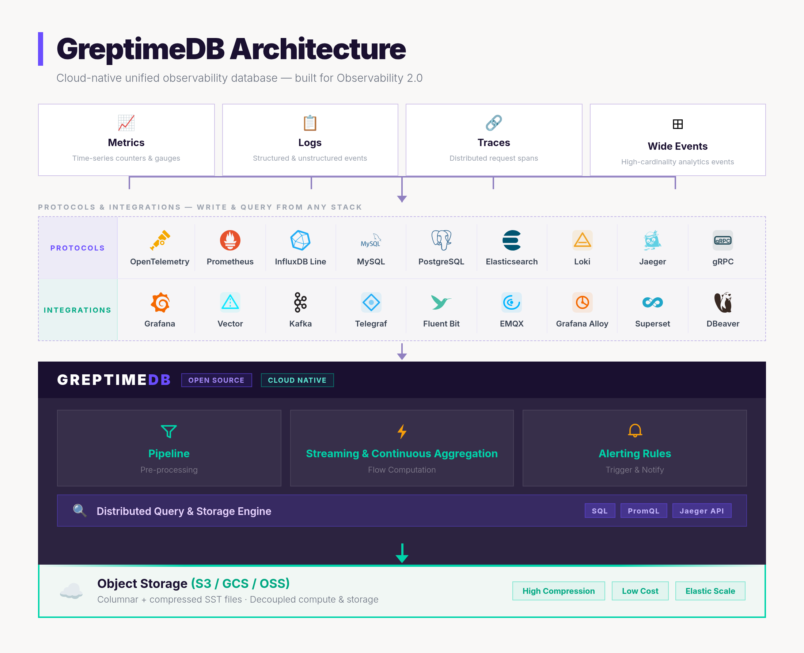

<p align="center">
  <picture>
    <source media="(prefers-color-scheme: light)" srcset="https://cdn.jsdelivr.net/gh/GreptimeTeam/greptimedb@main/docs/logo-text-padding.png">
    <source media="(prefers-color-scheme: dark)" srcset="https://cdn.jsdelivr.net/gh/GreptimeTeam/greptimedb@main/docs/logo-text-padding-dark.png">
    
  </picture>
</p>

<h2 align="center">Metrics, logs, and traces.<br/>
One engine, on your infrastructure.</h2>

> A columnar database for metrics, logs, and traces on object storage.
> Apache-2.0 licensed core.

<div align="center">

<a href="https://docs.greptime.com/user-guide/overview/">User Guide</a> &nbsp;·&nbsp;
<a href="https://greptimedb.rs/">API Docs</a> &nbsp;·&nbsp;
<a href="https://github.com/GreptimeTeam/greptimedb/issues/7685">Roadmap 2026</a> &nbsp;·&nbsp;
<a href="https://greptime.com/slack">Slack</a>

<a href="https://github.com/GreptimeTeam/greptimedb/releases/latest"></a>
<a href="https://github.com/GreptimeTeam/greptimedb/releases"></a>
<a href="https://github.com/GreptimeTeam/greptimedb/releases"></a>
<a href="https://hub.docker.com/r/greptime/greptimedb/"></a>
<a href="https://github.com/GreptimeTeam/greptimedb/blob/main/LICENSE"></a>

<sub><b>stable</b> for production &nbsp;·&nbsp; <b>canary</b> includes pre-releases &nbsp;·&nbsp; <b>nightly</b> is a weekly snapshot of <code>main</code></sub>

</div>

## Introduction

**GreptimeDB** is an open-source observability database. Metrics, logs, and traces run on one columnar engine over object storage and share one [table model](https://docs.greptime.com/user-guide/concepts/data-model/): tags, timestamp, and fields. When signals carry common identifiers such as service, host, or trace ID, you can correlate them in SQL without moving data between databases.

Ingest through OpenTelemetry, Prometheus Remote Write, Loki Push, or Elasticsearch Bulk. Use SQL across observability data and PromQL for metrics. Migrate ingestion one signal at a time without rebuilding your collectors.

## One Query Across Signals

OpenTelemetry ingestion writes spans to `opentelemetry_traces` and log records to
`opentelemetry_logs`. Both tables carry `trace_id`, so correlating them is a join:

```sql
-- The slowest failed spans in the last hour,
-- with the log lines emitted inside those same traces.
SELECT
    t.service_name,
    t.span_name,
    t.duration_nano / 1000000 AS duration_ms,
    l.timestamp AS log_time,
    l.severity_text,
    l.body
FROM opentelemetry_traces t
JOIN opentelemetry_logs l ON l.trace_id = t.trace_id
WHERE t.timestamp > now() - INTERVAL '1' HOUR
  AND t.span_status_code = 'STATUS_CODE_ERROR'
ORDER BY t.duration_nano DESC
LIMIT 20;
```

Metrics join the same way, on any tag the tables share, such as `service`,
`host`, or `pod`.

## Why You Might Use It

- You run Prometheus plus Loki or Elasticsearch and want one backend instead of three
- You have outgrown Prometheus on cardinality or retention and don't want the Thanos/Mimir operational surface
- You are hitting Loki's query performance limits as log volume grows
- You need long retention on object storage without a separate analytics stack
- You want to query telemetry with SQL, not only a domain query language
- You are storing GenAI or agent telemetry ([OTel GenAI conventions](https://opentelemetry.io/docs/specs/semconv/gen-ai/)) alongside infrastructure signals

Learn more in [Why GreptimeDB](https://docs.greptime.com/user-guide/concepts/why-greptimedb).

## What's Supported

| | |
|---|---|
| **Ingest** | [OpenTelemetry (OTLP)](https://docs.greptime.com/user-guide/ingest-data/for-observability/opentelemetry/), [Prometheus Remote Write](https://docs.greptime.com/user-guide/ingest-data/for-observability/prometheus/), [Loki Push](https://docs.greptime.com/user-guide/ingest-data/for-observability/loki), [Elasticsearch Bulk](https://docs.greptime.com/user-guide/ingest-data/for-observability/elasticsearch), [InfluxDB line protocol](https://docs.greptime.com/user-guide/protocols/influxdb-line-protocol), [gRPC](https://docs.greptime.com/user-guide/protocols/grpc/) |
| **Query** | [SQL](https://docs.greptime.com/user-guide/query-data/overview/), [PromQL](https://docs.greptime.com/user-guide/query-data/promql/), [Jaeger-compatible trace queries](https://docs.greptime.com/user-guide/query-data/jaeger/), MySQL and PostgreSQL wire protocols |
| **Storage** | S3, GCS, Azure Blob and S3-compatible endpoints as [primary storage](https://docs.greptime.com/user-guide/deployments-administration/configuration/#storage-options), with memory and local-disk caches |
| **Built in** | Retention policies, downsampling, [continuous aggregation](https://docs.greptime.com/user-guide/flow-computation/overview), explicit table partitioning, and [inverted / skipping / fulltext indexes](https://docs.greptime.com/user-guide/manage-data/data-index) |

Compute and storage are disaggregated: object storage holds the data, while memory and local-disk caches keep recent and frequently queried data close to compute.

<p align="center">
  <a href="https://github.com/GreptimeTeam/greptimedb/raw/main/docs/overview.png" target="_blank" rel="noopener">
    
  </a>
</p>

## Benchmarks

* [Agent RCA Bench](https://rca-bench.greptime.com/): LLM agents doing root cause analysis
  over GreptimeDB versus Prometheus + Loki + Tempo. 40% fewer wrong diagnoses, 48% fewer
  input tokens, 45% lower cost
  ([write-up](https://greptime.com/blogs/2026-09-08-agent-rca-bench-interface-semantic-layer))
* [GreptimeDB tops JSONBench's billion-record cold run test](https://greptime.com/blogs/2025-03-18-jsonbench-greptimedb-performance)
* [TSBS Benchmark](https://github.com/GreptimeTeam/greptimedb/tree/main/docs/benchmarks/tsbs)
* [More benchmark reports](https://docs.greptime.com/user-guide/concepts/features-that-you-concern#how-is-greptimedbs-performance-compared-to-other-solutions)

## Compatibility and Migration

Compatibility is per protocol, and query-side coverage is narrower than ingestion.

| | Compatible | Not compatible |
|---|---|---|
| **Prometheus** | Remote Write ingestion; PromQL queries | Gaps are listed in [PromQL compatibility](https://docs.greptime.com/user-guide/query-data/promql/) |
| **Loki** | Push ingestion; dual-write through Grafana Alloy makes the [cutover gradual](https://greptime.com/blogs/2026-07-23-from-loki-to-greptimedb-dual-write-migration) | LogQL and the rest of the Loki query API |
| **Elasticsearch** | `_bulk` ingestion in the open-source core; [QueryDSL](https://docs.greptime.com/enterprise/elasticsearch-compatible/query/) partially, in Enterprise | Most other Elasticsearch APIs |

## Limitations and Edition Boundary

Cluster deployment, object storage, the Flow engine, and every ingestion protocol listed above are in the Apache-2.0 build. Repartitioning, region migration, and index creation are manual operations there.

Read replicas, workload isolation, and automated repartitioning are **GreptimeDB Enterprise** features, along with enterprise security and governance. The [Enterprise overview](https://docs.greptime.com/enterprise/overview/) has the current list, and [pricing](https://www.greptime.com/pricing#differences) has the edition comparison.

## Architecture

GreptimeDB can run in two modes:
* **Standalone** — single binary for development and small deployments.
* **Distributed** — four components, each independently scalable:
  - **Frontend** — protocol entry (OTel, Prometheus, MySQL/PostgreSQL, gRPC, ingestion APIs for Elasticsearch/InfluxDB/Loki) and the distributed query engine. Stateless, scales horizontally.
  - **Datanode** — region engine with WAL, memtable, SST, cache, compaction, and indexes. Persists data to object storage. Elastic.
  - **Metasrv** — metadata, routing, repartitioning, and security. Backed by a pluggable KV layer (etcd or RDS).
  - **Flownode** (optional) — continuous flow computation (streaming and materialized views).

For deeper coverage, see the [architecture doc](https://docs.greptime.com/contributor-guide/overview/#architecture) or [DeepWiki](https://deepwiki.com/GreptimeTeam/greptimedb/1-overview).

<a href="https://github.com/GreptimeTeam/greptimedb/raw/main/docs/architecture.png" target="_blank" rel="noopener">
  
</a>

## Try GreptimeDB

**For AI agents** — paste this prompt into your agent:

```text
Read https://docs.greptime.com/SKILL.md and follow the instructions
to deploy, configure, ingest, and query GreptimeDB.
```

```shell
docker run -p 127.0.0.1:4000-4003:4000-4003 \
  -v "$(pwd)/greptimedb_data:/greptimedb_data" \
  --name greptime --rm \
  greptime/greptimedb:latest standalone start \
  --http-addr 0.0.0.0:4000 \
  --grpc-bind-addr 0.0.0.0:4001 \
  --mysql-addr 0.0.0.0:4002 \
  --postgres-addr 0.0.0.0:4003
```
Dashboard: [http://localhost:4000/dashboard](http://localhost:4000/dashboard)

Read more in the [full Install Guide](https://docs.greptime.com/getting-started/installation/overview).

**Troubleshooting:**
* Cannot connect to the database? Ensure that ports `4000`, `4001`, `4002`, and `4003` are not blocked by a firewall or used by other services.
* Failed to start? Check the container logs with `docker logs greptime` for further details.

## Getting Started

- [Quickstart](https://docs.greptime.com/getting-started/quick-start)
- [User Guide](https://docs.greptime.com/user-guide/overview)
- [Demo Scenes](https://github.com/GreptimeTeam/demo-scene)
- [FAQ](https://docs.greptime.com/faq-and-others/faq)

## Build From Source

**Prerequisites:**
* [Rust toolchain](https://www.rust-lang.org/tools/install) — nightly, pinned by [`rust-toolchain.toml`](https://github.com/GreptimeTeam/greptimedb/blob/main/rust-toolchain.toml)
* [Protobuf compiler](https://grpc.io/docs/protoc-installation/) (>= 3.15)
* C/C++ building essentials: `gcc` / `g++` / `autoconf` and the glibc dev package (`libc6-dev` on Ubuntu, `glibc-devel` on Fedora)
* Python toolchain (optional, only for some test scripts)

**Build and run:**
```bash
make                          # build greptime binary
cargo run -- standalone start # start in standalone mode
```

**Common dev commands:**
```bash
make fmt            # format Rust code
make clippy         # lint (fails on warnings)
make test           # unit + integration tests (uses cargo-nextest)
make sqlness-test   # SQL regression tests
```

See the [Contribution Guidelines](CONTRIBUTING.md) for the full developer workflow.

## Tools & Extensions

- **Kubernetes**: [GreptimeDB Operator](https://github.com/GreptimeTeam/greptimedb-operator)
- **Helm Charts**: [Greptime Helm Charts](https://github.com/GreptimeTeam/helm-charts)
- **Dashboard**: [Web UI](https://github.com/GreptimeTeam/dashboard)
- **gRPC Ingester**: [Go](https://github.com/GreptimeTeam/greptimedb-ingester-go), [Java](https://github.com/GreptimeTeam/greptimedb-ingester-java), [C++](https://github.com/GreptimeTeam/greptimedb-ingester-cpp), [Erlang](https://github.com/GreptimeTeam/greptimedb-ingester-erl), [Rust](https://github.com/GreptimeTeam/greptimedb-ingester-rust), [.NET](https://github.com/GreptimeTeam/greptimedb-ingester-dotnet), [TypeScript](https://github.com/GreptimeTeam/greptimedb-ingester-ts)
- **Grafana Data Source**: [GreptimeDB Grafana data source plugin](https://github.com/GreptimeTeam/greptimedb-grafana-datasource)
- **Grafana Dashboard**: [Official Dashboard for monitoring](https://github.com/GreptimeTeam/greptimedb/blob/main/grafana/README.md)

## Project Status

GreptimeDB is generally available, with stable APIs and regular releases. It runs in production at scale — [OceanBase Cloud](https://greptime.com/blogs/2025-07-22-user-case-obcloud-log-management-greptimedb) operates 80+ GreptimeDB clusters managing 300 TB of logs, cutting log storage cost by 60%+ after migrating from Grafana Loki. See more in [case studies](https://greptime.com/blogs/?category=Use%20Case).

Release lines and support windows are in the [version reference](https://docs.greptime.com/nightly/reference/about-greptimedb-version). For where the project is going, read the [v1.0 highlights](https://greptime.com/blogs/2025-11-05-greptimedb-v1-highlights) and the [2026 roadmap](https://greptime.com/blogs/2026-02-11-greptimedb-roadmap-2026).

## Community

We invite you to engage and contribute!

- [Slack](https://greptime.com/slack)
- [Discussions](https://github.com/GreptimeTeam/greptimedb/discussions)
- [Official Website](https://greptime.com/)
- [Blog](https://greptime.com/blogs/)
- [LinkedIn](https://www.linkedin.com/company/greptime/)
- [X (Twitter)](https://X.com/greptime)
- [YouTube](https://www.youtube.com/@greptime)

If GreptimeDB is useful to you, please star the repo.


## License

GreptimeDB is an open-core project. Its core is licensed under the
[Apache License 2.0](https://apache.org/licenses/LICENSE-2.0.txt).

A small set of peripheral, enterprise-only features are gated behind the
`enterprise` Cargo feature (not built by default) and are governed by the
separate [GreptimeDB Enterprise License](LICENSE-ENTERPRISE). Source files under
that license carry an explicit Enterprise License header.

## Commercial Support

Scaling observability on your infrastructure?
[GreptimeDB Enterprise](https://docs.greptime.com/enterprise/overview/) adds the operational,
security, and support layer for production deployments.
[Contact us](https://greptime.com/contactus) for details.

## Contributing

- Read our [Contribution Guidelines](CONTRIBUTING.md).
- Explore [Internal Concepts](https://docs.greptime.com/contributor-guide/overview.html) and [DeepWiki](https://deepwiki.com/GreptimeTeam/greptimedb).
- Pick up a [good first issue](https://github.com/GreptimeTeam/greptimedb/issues?q=is%3Aissue+is%3Aopen+label%3A%22good+first+issue%22) and join the #contributors [Slack](https://greptime.com/slack) channel.

[](https://github.com/GreptimeTeam/greptimedb/actions/workflows/integration.yml)
[](https://codecov.io/gh/GreptimeTeam/greptimedb)

## Acknowledgement

Special thanks to all contributors! See [AUTHOR.md](AUTHOR.md).

- Uses [Apache Arrow™](https://arrow.apache.org/) (memory model)
- [Apache Parquet™](https://parquet.apache.org/) (file storage)
- [Apache DataFusion™](https://datafusion.apache.org/) (query engine)
- [Apache OpenDAL™](https://opendal.apache.org/) (data access abstraction)

---

*All trademarks, logos, and brand names referenced in this README and in the Overview diagram are the property of their respective owners. Their use is for identification purposes only and does not imply endorsement or affiliation.*
