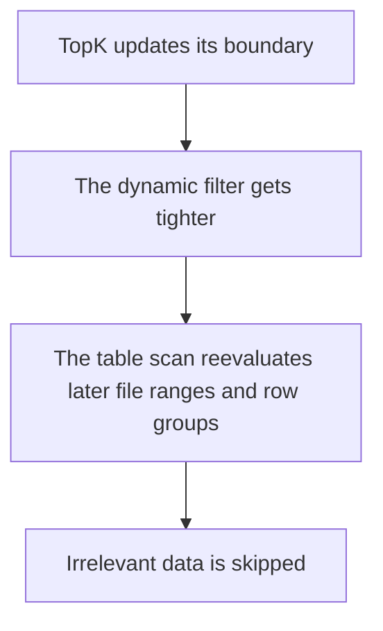

# From Tens of Seconds to Sub-Second: How GreptimeDB Speeds Up TopK Queries

`ORDER BY ... LIMIT 10` looks cheap because it only returns a few rows. On a large table, it often is not. If the sort key is not the time-index column, the database may still need to read a large amount of data before it can determine which 10 rows belong in the final result.

GreptimeDB improves this path by passing the runtime boundary formed by TopK to the scan as early as possible. Once later data can no longer enter the final result, the scan can skip it. On a real traces dataset, this turns `ORDER BY end_time DESC LIMIT 10` from tens of seconds into a sub-second query.

## Why `ORDER BY ... LIMIT` can still be expensive

Consider this query:

```sql
SELECT start_time, end_time, run_type, status
FROM langchain_traces
ORDER BY end_time DESC
LIMIT 10;
```

Under the old path, the scan could not see TopK's runtime state and had to keep reading until the query finished. Even though the query returned only 10 rows, it could still scan a large amount of data first. Only after the query finished was it clear that much of that work had not been necessary.

Here `start_time` is the table's time-index column, while `end_time` is not. GreptimeDB previously had a more complex optimization called window sort, which depended more on time-index data distribution. Now both kinds of TopK queries go through the same dynamic-filtering path.

## How dynamic filtering changes the scan path

The execution path is now straightforward:

1. The query starts with a loose condition.
2. As TopK sees more candidate rows, the current boundary tightens.
3. That boundary is immediately turned into a dynamic filter and pushed down to the scan.
4. The scan uses file and row-group statistics to skip data that can no longer match.

For queries like `ORDER BY end_time DESC LIMIT 10`, the win comes from narrowing the scan range earlier, not from returning fewer rows.

## How the runtime threshold becomes a pruning condition

Once TopK has a meaningful boundary, GreptimeDB uses it as part of the dynamic predicate seen by the scan.

In practice, it becomes a null-preserving predicate such as:

```text
end_time IS NULL OR end_time > X
```

The scan does not need to read all rows before benefiting from this predicate. If row-group statistics already show that a range cannot satisfy the latest condition, GreptimeDB can prune it before reading the data.



## How to verify it in the execution plan

`EXPLAIN ANALYZE VERBOSE` shows whether this path is active.

On the `end_time` query, the TopK node shows the runtime filter:

```text
SortExec: TopK(fetch=10), expr=[end_time@1 DESC], preserve_partitioning=[true],
filter=[end_time@1 IS NULL OR end_time@1 > 1753660799999000000]
```

The scan side shows that the filter has been propagated:

```text
UnorderedScan: ..., "dyn_filters":
["DynamicFilter [ end_time@1 IS NULL OR end_time@1 > 1753660799999000000 ]"]
```

Together, these two fragments show:

- `SortExec: TopK(..., filter=[...])`: TopK has formed a runtime threshold.
- scan `dyn_filters`: the scan receives that threshold and uses it for pruning.

If both signals are present, dynamic filtering is usually active on this query.

## What the speedup looks like in practice

On this traces dataset, the clearest example is this query:

```sql
SELECT *
FROM langchain_traces
ORDER BY end_time DESC
LIMIT 10;
```

| Query | Before | Now | Notes |
| --- | ---: | ---: | --- |
| `ORDER BY end_time DESC LIMIT 10` | ~`28.9s` | ~`0.21s` | `end_time` is not the time-index column, and the old unoptimized path effectively scanned the whole table; after switching to dynamic filtering, later scan work can be pruned much earlier |
| `ORDER BY start_time DESC LIMIT 10` | `0.334s` / `0.336s` / `0.342s` | `0.336s` / `0.340s` / `0.336s` | `start_time` is the time-index column; window sort was already fast in this case, so switching to dynamic filtering changes little in practice |

In practice:

- `end_time`-style queries on non-time-index sort keys were slow mainly because the old path scanned the whole table; dynamic filtering lets TopK's boundary prune later scan work.
- Both `start_time` and `end_time` TopK queries now go through dynamic filtering. The older window sort path was more complex and more dependent on time-index data distribution; dynamic filtering replaces it with a more unified execution path.

This optimization changes scan volume. The exact speedup still depends on data distribution, row-group statistics, and the size of `LIMIT`.

## Which queries benefit the most

Dynamic filtering is strongest when all of the following line up:

- `k` is small;
- row-group statistics are selective enough to make pruning useful;
- value distribution lets the TopK boundary become meaningful early.

It is much less dramatic when:

- the query is already efficient;
- the filter stays close to `true` for most of execution;
- row-group min/max ranges are too wide to prune much;
- `LIMIT` is large enough that the boundary tightens late.

If scan cost dominates and the data distribution is suitable, this path can significantly reduce query cost.

## What to check on your own queries

For now, the dynamic-filtering path discussed here is mainly the local TopK path. Remote dynamic-filter propagation in distributed queries—especially for join-related dynamic filters—is still under active development; for the current design status, see the [remote dyn filter RFC](https://github.com/GreptimeTeam/greptimedb/blob/main/docs/rfcs/remote-dyn-filter-rfc.md).

If you have an `ORDER BY ... LIMIT k` query on a non-indexed sort key that is still slow, start with these two signals in the plan:

- a filter on the TopK node;
- propagated `dyn_filters` on the scan node.

If both are present, the query is probably on the dynamic-filtering path.

If neither shows up, first check whether the query is even on a path that supports dynamic filtering today.

The key change is not that the result only returns a few rows. It is that the scan can stop much earlier. That is where dynamic filtering changes the cost of TopK queries.
