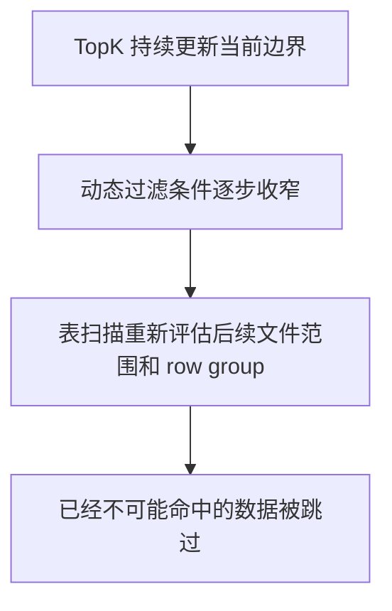

# 从几十秒到亚秒级：GreptimeDB 如何加速 TopK 查询

`ORDER BY ... LIMIT 10` 看起来只返回几行，很多时候却不便宜。表一大、排序键又不是时间索引时，数据库往往还是得先读很多数据，才能确定最终该返回哪 10 行。

GreptimeDB 在这条路径上的做法，是把 TopK 在执行过程中形成的运行时边界尽早交给扫描侧。后面的数据如果已经不可能进入最终结果，就不必继续读。在一组真实 traces 数据上，`ORDER BY end_time DESC LIMIT 10` 因此从几十秒降到了亚秒级。

## 为什么 `ORDER BY ... LIMIT` 仍然可能很慢

先看一个典型查询：

```sql
SELECT start_time, end_time, run_type, status
FROM langchain_traces
ORDER BY end_time DESC
LIMIT 10;
```

在旧路径里，扫描侧看不到 TopK 在执行过程中的状态，只能一直读到查询结束。即使最后只返回 10 行，前面也还是可能要扫大量数据；等查询跑完之后，系统才知道其中很多数据其实根本没必要读。

这里还有一个背景：`start_time` 是这张表的时间索引列，`end_time` 不是。更早有一套名为 window sort 的优化，逻辑更复杂，也更依赖 time index 的数据分布。现在这两类 TopK 查询都统一走动态过滤（dyn filter）这条路径。

## 动态过滤怎样改变扫描路径

执行路径现在是这样的：

1. 查询刚开始时，过滤条件还很宽。
2. 随着 TopK 看到更多候选行，当前边界逐渐收窄。
3. 这个边界会立刻转成动态过滤条件，下推给扫描侧。
4. 扫描侧结合文件和 row group 的统计信息，提前跳过已经不可能命中的数据。

对 `ORDER BY end_time DESC LIMIT 10` 这种查询，收益主要来自扫描范围更早收窄，而不是结果集更小。

## 运行时阈值怎样变成剪枝条件

当 TopK 已经形成一个有意义的边界时，GreptimeDB 会把这个边界作为动态过滤条件的一部分交给扫描侧。

在实践里，它会变成类似下面这种保留空值语义的谓词：

```text
end_time IS NULL OR end_time > X
```

扫描侧不需要先把所有行都读出来，才能从这个条件中受益。只要 row group 统计信息已经说明某个范围不可能满足最新条件，GreptimeDB 就可以在真正读取数据之前把它排除掉。



## 怎样从执行计划里确认它生效了

`EXPLAIN ANALYZE VERBOSE` 可以直接看到这条路径是否生效。

在 `end_time` 查询上，TopK 节点会显示运行时过滤条件：

```text
SortExec: TopK(fetch=10), expr=[end_time@1 DESC], preserve_partitioning=[true],
filter=[end_time@1 IS NULL OR end_time@1 > 1753660799999000000]
```

扫描节点则会显示这个条件已经被传了下去：

```text
UnorderedScan: ..., "dyn_filters":
["DynamicFilter [ end_time@1 IS NULL OR end_time@1 > 1753660799999000000 ]"]
```

这两段信息放在一起看，说明两件事：

- `SortExec: TopK(..., filter=[...])`：TopK 已经形成了运行时阈值；
- 扫描节点里的 `dyn_filters`：扫描侧收到了这个阈值，并开始据此剪枝。

如果执行计划里这两个信号都在，通常就说明动态过滤已经走通了。

## 实际收益有多大

在这组 traces 数据上，最能体现变化的是下面这条查询：

```sql
SELECT *
FROM langchain_traces
ORDER BY end_time DESC
LIMIT 10;
```

| Query | 之前 | 现在 | 说明 |
| --- | ---: | ---: | --- |
| `ORDER BY end_time DESC LIMIT 10` | ~`28.9s` | ~`0.21s` | `end_time` 不是时间索引列，旧的未优化路径基本会把表扫完；切到动态过滤路径之后，后续扫描可以更早被剪掉 |
| `ORDER BY start_time DESC LIMIT 10` | `0.334s` / `0.336s` / `0.342s` | `0.336s` / `0.340s` / `0.336s` | `start_time` 是时间索引列；window sort 在这类场景里本来就已经很快，所以切到动态过滤后变化不大 |

这里主要有两点：

- `end_time` 这类非时间索引排序查询，之前慢，主要是因为旧路径会扫描全表；切到动态过滤之后，TopK 的边界可以直接拿来提前剪掉后续扫描。
- `start_time` 和 `end_time` 这两类 TopK 查询，现在都走动态过滤；window sort 那条更复杂、也更依赖 time index 数据分布的路径，已经被这条更统一的执行方式取代。

这项优化真正改变的是扫描量。具体能快多少，还是取决于数据分布、row group 统计信息和 `LIMIT` 的大小。

## 哪些查询最容易受益

动态过滤通常在下面这些条件同时满足时收益最明显：

- `k` 比较小；
- row group 统计信息有足够选择性；
- 数据分布让 TopK 边界能较早变得有意义。

而在这些场景里，收益通常不会那么夸张：

- 查询本来就已经很高效；
- 过滤条件在大部分执行过程中都接近 `true`；
- row group 的 min/max 范围太宽，难以有效剪枝；
- `LIMIT` 很大，导致边界收窄得太晚。

如果查询本身足够受扫描成本影响，数据形态也合适，这条路径就有机会明显改变查询成本。

## 自己排查时先看什么

这里讨论的动态过滤，目前主要还是本地 TopK 这条路径。分布式查询里的远程动态过滤传播，尤其是 join 相关场景，还在开发中；具体可以参考 [remote dyn filter RFC](https://github.com/GreptimeTeam/greptimedb/blob/main/docs/rfcs/remote-dyn-filter-rfc.md)。

如果你手头正好有 `ORDER BY ... LIMIT k`（排序键不是索引列）仍然偏慢的查询，先看执行计划里的两个信号：

- TopK 节点里有没有过滤条件；
- 扫描节点里有没有传播下来的 `dyn_filters`。

这两个信号如果都在，通常就说明这条优化路径已经生效了。

如果这两个信号都不在，那就要先确认这条查询是不是还没走到当前支持的动态过滤路径上。

对这类 TopK 查询来说，真正关键的变化不是结果只返回几行，而是后面的扫描能不能更早停下来。这正是动态过滤带来的价值。
