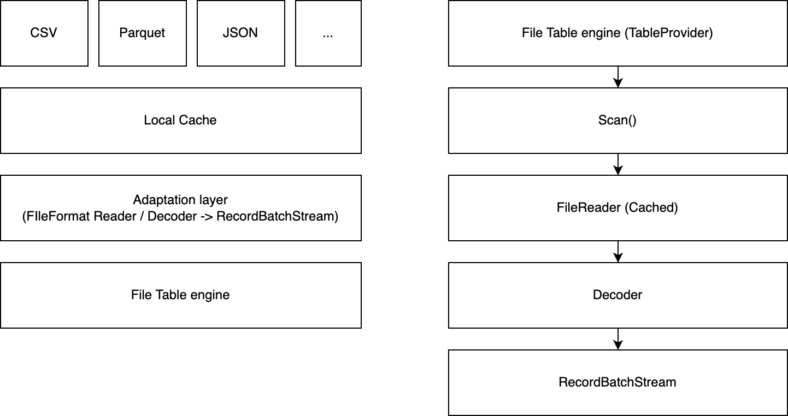
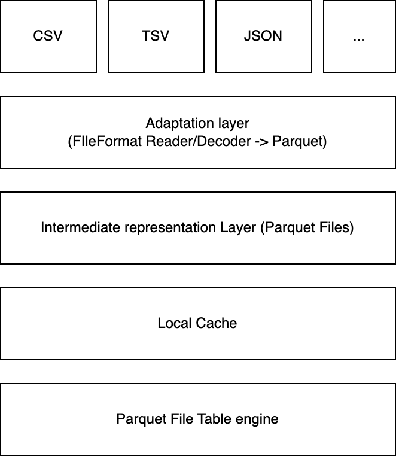

File external table

---

# Summary

Allows users to perform SQL queries on files

# Motivation

User data may already exist in other storages, i.g., file systems/s3, etc. in CSV, parquet, JSON format, etc. We can provide users the ability to perform SQL queries on these files.


# Details

## Overview

The file external table providers users ability to perform SQL queries on these files.

For example, a user has a CSV file on the local file system `/var/data/city.csv`:

```
Rank , Name , State , 2023 Population , 2020 Census , Annual Change , Density (mi²)
1 , New York City , New York , 8,992,908 , 8,804,190 , 0.7% , 29,938
2 , Los Angeles , California , 3,930,586 , 3,898,747 , 0.27% , 8,382
3 , Chicago , Illinois , 2,761,625 , 2,746,388 , 0.18% , 12,146
.....
```

Then user can create a file external table with:

```sql
CREATE EXTERNAL TABLE city with(location='/var/data/city.csv', format="CSV", field_delimiter = ',', record_delimiter = '\n', skip_header = 1);
```

Then query the external table with:

```bash
MySQL> select * from city;
```

| Rank | Name          | State      | 2023 Population | 2020 Census | Annual Change | Density (mi²) |
| :--- | :------------ | :--------- | :-------------- | :---------- | :------------ | :------------ |
| 1    | New York City | New York   | 8,992,908       | 8,804,190   | 0.7%          | 29,938        |
| 2    | Los Angeles   | California | 3,930,586       | 3,898,747   | 0.27%         | 8,382         |
| 3    | Chicago       | Illinois   | 2,761,625       | 2,746,388   | 0.18%         | 12,146        |

Drop the external table, if needs with:

```sql
DROP EXTERNAL TABLE city
```


### Syntax

```
CREATE EXTERNAL [<database>.]<table_name>
[
 (
    <col_name> <col_type> [NULL | NOT NULL] [COMMENT "<comment>"]
 )
]
[ WITH
 (
     LOCATION = 'url'
   [,FIELD_DELIMITER =  'delimiter' ]
   [,RECORD_DELIMITER =  'delimiter' ]
   [,SKIP_HEADER =  '<number>' ]
   [,FORMAT =  { csv | json | parquet } ]
   [,PATTERN = '<regex_pattern>' ]
   [,ENDPOINT = '<uri>' ]
   [,ACCESS_KEY_ID = '<key_id>' ]
   [,SECRET_ACCESS_KEY = '<access_key>' ]
   [,SESSION_TOKEN = '<token>' ]
   [,REGION = '<region>' ]
   [,ENABLE_VIRTUAL_HOST_STYLE = '<boolean>']
   ..
 )
]
```

### Supported File Format

The external file table supports multiple formats; We divide formats into row format and columnar format.

Row formats:

- CSV, JSON

Columnar formats:

- Parquet

Some of these formats support filter pushdown, and others don't. If users use very large files, that format doesn't support pushdown, which might consume a lot of IO for scanning full files and cause a long running query.

### File Table Engine



We implement a file table engine that creates an external table by accepting user-specified file paths and treating all records as immutable.

1. File Format Decoder: decode files to the `RecordBatch` stream.
2. File Table Engine: implement the `TableProvider` trait, store necessary metadata in memory, and provide scan ability.

Our implementation is better for small files. For large files(i.g., a GB-level CSV file), suggests our users import data to the database.

## Drawbacks

- Some formats don't support filter pushdown
- Hard to support indexing

## Life cycle

### Register a table

1. Write metadata to manifest.
2. Create the table via file table engine.
3. Register table to `CatalogProvider` and register table to `SystemCatalog`(persist tables to disk).

### Deregister a table (Drop a table)

1. Fetch the target table info (figure out table engine type).
2. Deregister the target table in `CatalogProvider` and `SystemCatalog`.
3. Find the target table engine.
4. Drop the target table.

### Recover a table when restarting

1. Collect tables name and engine type info.
2. Find the target tables in different engines.
3. Open and register tables.

# Alternatives

## Using DataFusion API

We can use datafusion API to register a file table:

```rust
let ctx = SessionContext::new();

ctx.register_csv("example", "tests/data/example.csv", CsvReadOptions::new()).await?;

// create a plan
let df = ctx.sql("SELECT a, MIN(b) FROM example WHERE a <= b GROUP BY a LIMIT 100").await?;
```

### Drawbacks

The DataFusion implements its own `Object Store` abstraction and supports parsing the partitioned directories, which can push down the filter and skips some directories. However, this makes it impossible to use our's `LruCacheLayer`(The parsing of the partitioned directories required paths as input). If we want to manage memory entirely, we should implement our own `TableProvider` or `Table`.

- Impossible to use `CacheLayer`

## Introduce an intermediate representation layer



We convert all files into `parquet` as an intermediate representation. Then we only need to implement a `parquet` file table engine, and we already have a similar one. Also, it supports limited filter pushdown via the `parquet` row group stats.

### Drawbacks

- Computing overhead
- Storage overhead


