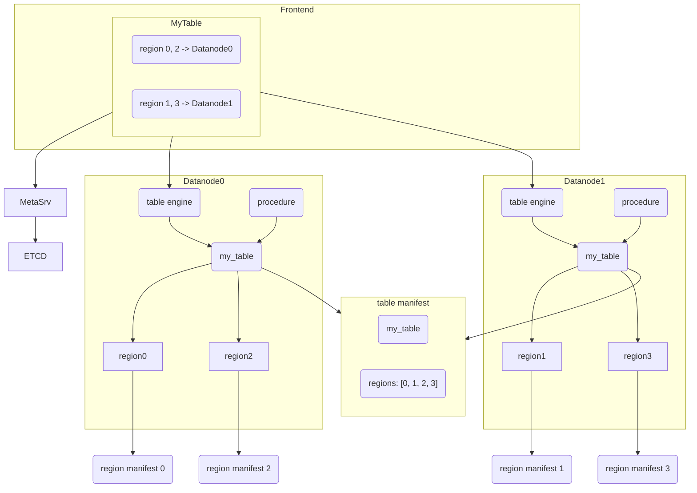
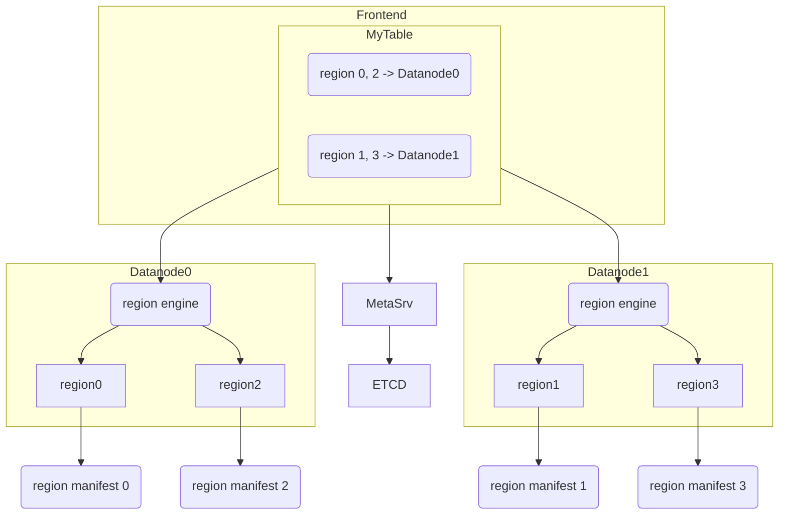
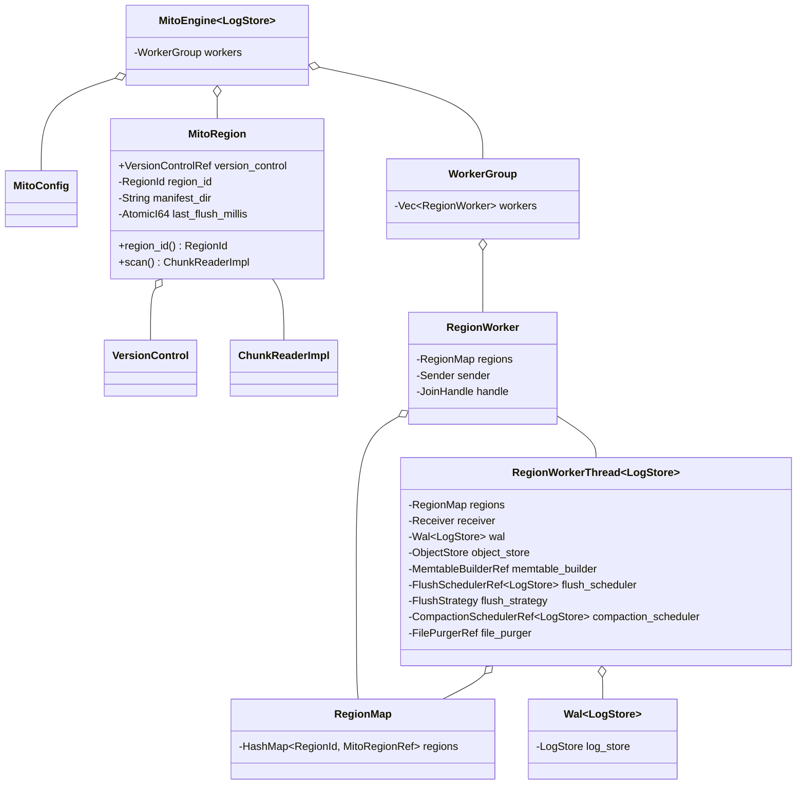
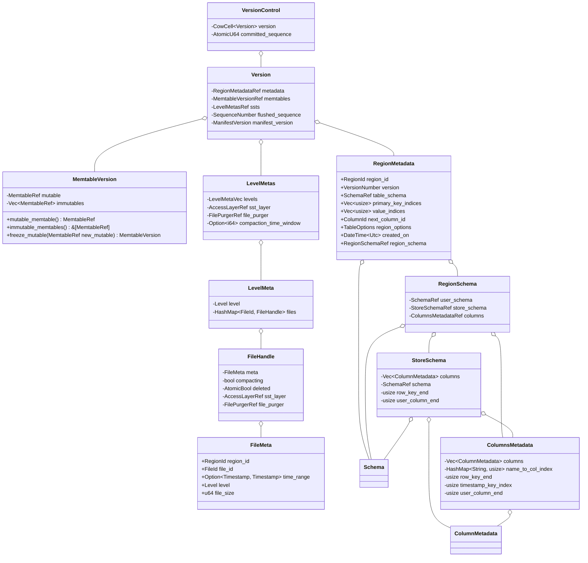

Refactor Table Engine
----------------------

# Summary
Refactor table engines to address several historical tech debts.

# Motivation
Both `Frontend` and `Datanode` have to deal with multiple regions in a table. This results in code duplication and additional burden to the `Datanode`.

Before:

`Datanodes` can update the same manifest file for a table as regions are assigned to different nodes in the cluster. We also have to run procedures on `Datanode` to ensure the table manifest is consistent with region manifests. "Table" in a `Datanode` is a subset of the table's regions. The `Datanode` is much closer to `RegionServer` in `HBase` which only deals with regions.

In cluster mode, we store table metadata in etcd and table manifest. The table manifest becomes redundant. We can remove the table manifest if we refactor the table engines to region engines that only care about regions. What's more, we don't need to run those procedures on `Datanode`.

After:

This RFC proposes to refactor table engines into region engines as a first step to make the `Datanode` acts like a `RegionServer`.

# Details
## Overview

We plan to refactor the `TableEngine` trait into `RegionEngine` gradually. This RFC focuses on the `mito` engine as it is the default table engine and the most complicated engine.

Currently, we built `MitoEngine` upon `StorageEngine` that manages regions of the `mito` engine. Since `MitoEngine` becomes a region engine, we could combine `StorageEngine` with `MitoEngine` to simplify our code structure.

The chart below shows the overall architecture of the `MitoEngine`.

We replace the `RegionWriter` with `RegionWorker` to process write requests and DDL requests.

## Metadata
We also merge region's metadata with table's metadata. It should make metadata much easier to maintain.

# Drawback
This is a breaking change.

# Future Work
- Rename `TableEngine` to `RegionEngine`
- Simplify schema relationship in the `mito` engine
- Refactor the `Datanode` into a `RegionServer`.
