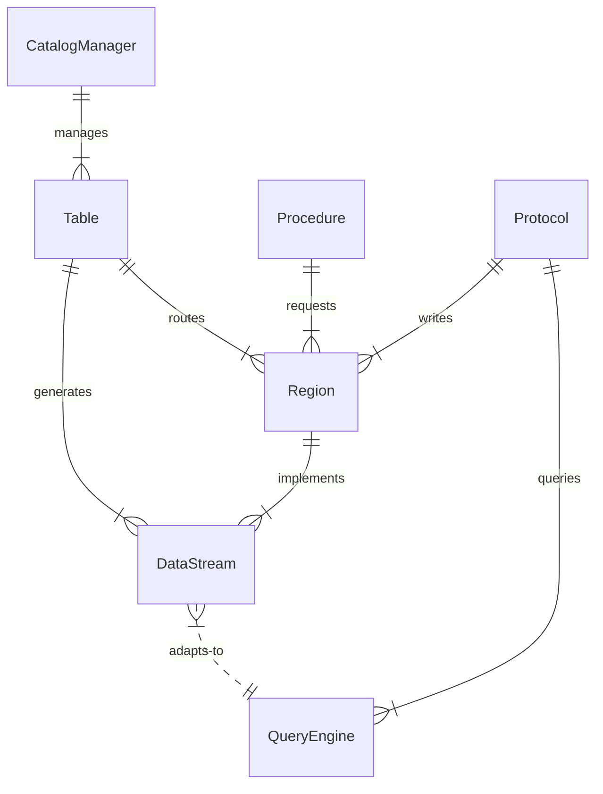

Refactor Table Trait
--------------------

# Summary
Refactor `Table` trait to adapt the new region server architecture and make code more straightforward.

# Motivation
The `Table` is designed in the background of both frontend and datanode keeping the same concepts. And all the operations are served by a `Table`. However, in our practice, we found that not all the operations are suitable to be served by a `Table`. For example, the `Table` doesn't hold actual physical data itself, thus operations like write or alter are simply a proxy over underlying regions. And in the recent refactor to datanode ([rfc table-engine-refactor](./2023-07-06-table-engine-refactor.md)), we are changing datanode to region server that is only aware of `Region` things. This also calls for a refactor to the `Table` trait.

# Details

## Definitions

The current `Table` trait contains the following methods:
```rust
pub trait Table {
    /// Get a reference to the schema for this table
    fn schema(&self) -> SchemaRef;

    /// Get a reference to the table info.
    fn table_info(&self) -> TableInfoRef;

    /// Get the type of this table for metadata/catalog purposes.
    fn table_type(&self) -> TableType;

    /// Insert values into table.
    ///
    /// Returns number of inserted rows.
    async fn insert(&self, _request: InsertRequest) -> Result<usize>;

    /// Generate a record batch stream for querying.
    async fn scan_to_stream(&self, request: ScanRequest) -> Result<SendableRecordBatchStream>;

    /// Tests whether the table provider can make use of any or all filter expressions
    /// to optimise data retrieval.
    fn supports_filters_pushdown(&self, filters: &[&Expr]) -> Result<Vec<FilterPushDownType>>;

    /// Alter table.
    async fn alter(&self, _context: AlterContext, _request: &AlterTableRequest) -> Result<()>;

    /// Delete rows in the table.
    ///
    /// Returns number of deleted rows.
    async fn delete(&self, _request: DeleteRequest) -> Result<usize>;

    /// Flush table.
    ///
    /// Options:
    /// - region_number: specify region to flush.
    /// - wait: Whether to wait until flush is done.
    async fn flush(&self, region_number: Option<RegionNumber>, wait: Option<bool>) -> Result<()>;

    /// Close the table.
    async fn close(&self, _regions: &[RegionNumber]) -> Result<()>;

    /// Get region stats in this table.
    fn region_stats(&self) -> Result<Vec<RegionStat>>;

    /// Return true if contains the region
    fn contains_region(&self, _region: RegionNumber) -> Result<bool>;

    /// Get statistics for this table, if available
    fn statistics(&self) -> Option<TableStatistics>;

    async fn compact(&self, region_number: Option<RegionNumber>, wait: Option<bool>) -> Result<()>;
}
```

We can divide those methods into three categories from the perspective of functionality:

|     Retrieve Metadata      | Manipulate Data |    Read Data     |
| :------------------------: | :-------------: | :--------------: |
|          `schema`          |    `insert`     | `scan_to_stream` |
|        `table_info`        |     `alter`     |                  |
|        `table_type`        |    `delete`     |                  |
| `supports_filter_pushdown` |     `flush`     |                  |
|       `region_stats`       |     `close`     |                  |
|     `contains_region`      |    `compact`    |                  |
|        `statistics`        |                 |                  |

And considering most of the access to metadata happens in frontend, like route or query; and all the persisted data are stored in regions; while only the query engine needs to read data. We can divide the `Table` trait into three concepts:

- struct `Table` provides metadata:
    ```rust
    impl Table {
        /// Get a reference to the schema for this table
        fn schema(&self) -> SchemaRef;

        /// Get a reference to the table info.
        fn table_info(&self) -> TableInfoRef;

        /// Get the type of this table for metadata/catalog purposes.
        fn table_type(&self) -> TableType;

        /// Get statistics for this table, if available
        fn statistics(&self) -> Option<TableStatistics>;

        fn to_data_source(&self) -> DataSourceRef;
    }
    ```
- Requests to region server
  - `InsertRequest`
  - `AlterRequest`
  - `DeleteRequest`
  - `FlushRequest`
  - `CompactRequest`
  - `CloseRequest`

- trait `DataSource` provides data (`RecordBatch`)
    ```rust
    trait DataSource {
        fn get_stream(&self, request: ScanRequest) -> Result<SendableRecordBatchStream>;
    }
    ```

## Use `Table`

`Table` will only be used in frontend. It's constructed from the `OpenTableRequest` or `CreateTableRequest`.

`Table` also provides a method `to_data_source` to generate a `DataSource` from itself. But this method is only for non-`TableType::Base` tables (i.e., `TableType::View` and `TableType::Temporary`) because `TableType::Base` table doesn't hold actual data itself. Its `DataSource` should be constructed from the `Region` directly (in other words, it's a remote query).

And it requires some extra information to construct a `DataSource`, named `TableSourceProvider`:

```rust
type TableFactory = Arc<dyn Fn() -> DataSourceRef>;

pub enum TableSourceProvider {
    Base,
    View(LogicalPlan),
    Temporary(TableFactory),
}
```

## Use `DataSource`

`DataSource` will be adapted to the `TableProvider` from DataFusion that can be `scan()`ed in a `TableScan` plan.

In frontend this is done in the planning phase. And datanode will have one implementation for `Region` to generate record batch stream.

## Interact with RegionServer

Previously, persisted state change operations were through the old `Table` trait, like said before. Now they will come from the action source, like the procedure or protocol handler directly to the region server. E.g., on alter table, the corresponding procedure will generate its `AlterRequest` and send it to regions. Or write request will be split in frontend handler, and sent to regions. `Table` only provides necessary metadata like route information if needed, but not the necessary part anymore.

## Implement temporary table

Temporary table is a special table that doesn't revolves to any persistent physical region. Examples are:
- the `Numbers` table for testing, which produces a record batch that contains 0-100 integers.
- tables in information schema. It is an interface for querying catalog's metadata. The contents are generated on the fly with information from `CatalogManager`. The `CatalogManager` can be held in `TableFactory`.
- Function table that produces data generated by a formula or a function. Like something that always `sin(current_timestamp())`.

## Relationship among those components

Here is a diagram to show the relationship among those components, and how they interact with each other.



# Drawback
This is a breaking change.
