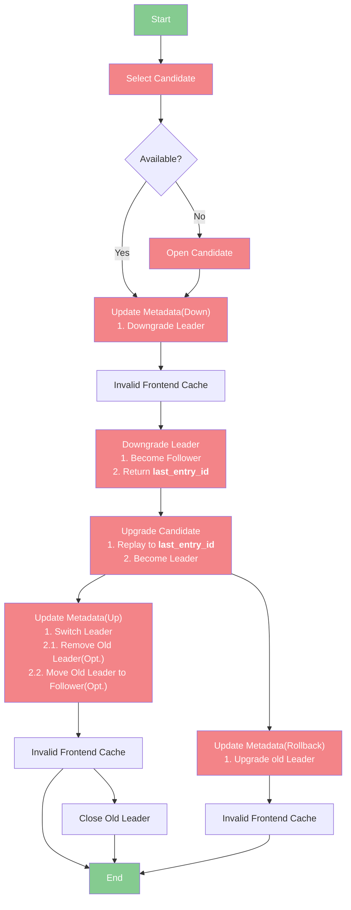

# Summary
This RFC proposes a way that brings the ability of Meta Server to move regions between the Datanodes.

# Motivation
Typically, We need this ability in the following scenarios:
- Migrate hot-spot Regions to idle Datanode
- Move the failure Regions to an available Datanode

# Details

**Only the red nodes will persist state after it has succeeded**, and other nodes won't persist state. (excluding the Start and End nodes).

## Steps

**The persistent context:** It's shared in each step and available after recovering. It will only be updated/stored after the Red node has succeeded.

Values: 
- `region_id`: The target leader region.
- `peer`: The target datanode.
- `close_old_leader`: Indicates whether close the region. 
- `leader_may_unreachable`: It's used to support the failover procedure.

**The Volatile context:** It's shared in each step and available in executing (including retrying). It will be dropped if the procedure runner crashes.

### Select Candidate

The Persistent state: Selected Candidate Region.

### Update Metadata(Down)

**The Persistent context:**
- The (latest/updated) `version` of `TableRouteValue`, It will be used in the step of `Update Metadata(Up)`.

### Downgrade Leader
This step sends an instruction via heartbeat and performs:
1. Downgrades leader region.
2. Retrieves the `last_entry_id` (if available).

If the target leader region is not found: 
- Sets `close_old_leader` to true.
- Sets `leader_may_unreachable` to true.

If the target Datanode is unreachable:
- Waits for region lease expired.
- Sets `close_old_leader` to true.
- Sets `leader_may_unreachable` to true.

**The Persistent context:**
None

**The Persistent state:** 
- `last_entry_id`

*Passes to next step.

### Upgrade Candidate
This step sends an instruction via heartbeat and performs:
1. Replays the WAL to latest(`last_entry_id`).
2. Upgrades the candidate region.

If the target region is not found: 
- Rollbacks.
- Notifies the failover detector if `leader_may_unreachable` == true.
- Exits procedure.

If the target Datanode is unreachable:
- Rollbacks.
- Notifies the failover detector if `leader_may_unreachable` == true.
- Exits procedure.

**The Persistent context:**
None

### Update Metadata(Up)
This step performs
1. Switches Leader.
2. Removes Old Leader(Opt.).
3. Moves Old Leader to follower(Opt.).

The `TableRouteValue` version should equal the `TableRouteValue`'s `version` in Persistent context. Otherwise, verifies whether `TableRouteValue` already updated.

**The Persistent context:**
None

### Close Old Leader(Opt.)
This step sends a close region instruction via heartbeat.

If the target leader region is not found: 
- Ignore.

If the target Datanode is unreachable: 
- Ignore.

### Open Candidate(Opt.)
This step sends an open region instruction via heartbeat and waits for conditions to be met (typically, the condition is that the `last_entry_id` of the Candidate Region is very close to that of the Leader Region or the latest).

If the target Datanode is unreachable: 
- Exits procedure.