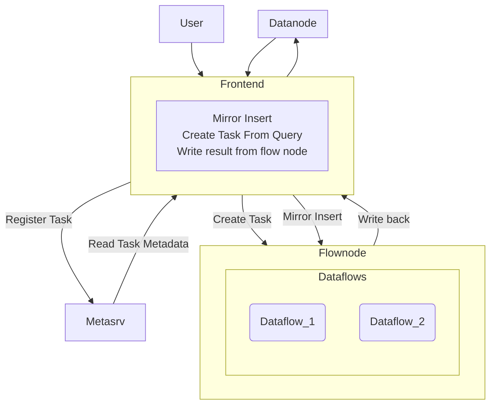

# Summary
This RFC proposes a Lightweight Module for executing continuous aggregation queries on a stream of data.

# Motivation
Being able to do continuous aggregation is a very powerful tool. It allows you to do things like:
1. downsample data from i.e. 1 milliseconds to 1 second
2. calculate the average of a stream of data
3. Keeping a sliding window of data in memory
In order to do those things while maintaining a low memory footprint, you need to be able to manage the data in a smart way. Hence, we only store necessary data in memory, and send/recv data deltas to/from the client.

# Details

## System boundary / What it's and isn't
- GreptimeFlow provides a way to perform continuous aggregation over time-series data.
- It's not a complete streaming-processing system. Only a must subset functionalities are provided.
- Flow can process a configured range of fresh data. Data exceeding this range will be dropped directly. Thus it cannot handle random datasets (random on timestamp).
- Both sliding windows (e.g., latest 5m from present) and fixed windows (every 5m from some time) are supported. And these two are the major targeting scenarios.
- Flow can handle most aggregate operators within one table(i.e. Sum, avg, min, max and comparison operators). But others (join, trigger, txn etc.) are not the target feature.

## Framework
- Greptime Flow's is built on top of [Hydroflow](https://github.com/hydro-project/hydroflow).
- We have three choices for the Dataflow/Streaming process framework for our simple continuous aggregation feature:
1. Based on the timely/differential dataflow crate that [materialize](https://github.com/MaterializeInc/materialize) based on. Later, it's proved too obscure for a simple usage, and is hard to customize memory usage control.
2. Based on a simple dataflow framework that we write from ground up, like what [arroyo](https://www.arroyo.dev/) or [risingwave](https://www.risingwave.dev/) did, for example the core streaming logic of [arroyo](https://github.com/ArroyoSystems/arroyo/blob/master/arroyo-datastream/src/lib.rs) only takes up to 2000 line of codes. However, it means maintaining another layer of dataflow framework, which might seem easy in the beginning, but I fear it might be too burdensome to maintain once we need more features.
3. Based on a simple and lower level dataflow framework that someone else write, like [hydroflow](https://github.com/hydro-project/hydroflow), this approach combines the best of both worlds. Firstly, it boasts ease of comprehension and customization. Secondly, the dataflow framework offers precisely the necessary features for crafting uncomplicated single-node dataflow programs while delivering decent performance.

Hence, we choose the third option, and use a simple logical plan that's anagonistic to the underlying dataflow framework, as it only describe how the dataflow graph should be doing, not how it do that. And we built operator in hydroflow to execute the plan. And the result hydroflow graph is wrapped in a engine that only support data in/out and tick event to flush and compute the result. This provide a thin middle layer that's easy to maintain and allow switching to other dataflow framework if necessary.

## Deploy mode and protocol
- Greptime Flow is an independent streaming compute component. It can be used either within a standalone node or as a dedicated node at the same level as frontend in distributed mode.
- It accepts insert request Rows, which is used between frontend and datanode.
- New flow job is submitted in the format of modified SQL query like snowflake do, like: `CREATE TASK avg_over_5m WINDOW_SIZE = "5m" AS SELECT avg(value) FROM table WHERE time > now() - 5m GROUP BY time(1m)`. Flow job then got stored in Metasrv.
- It also persists results in the format of Rows to frontend.
- The query plan uses Substrait as codec format. It's the same with GreptimeDB's query engine.
- Greptime Flow needs a WAL for recovering. It's possible to reuse datanode's.

The workflow is shown in the following diagram

## Lifecycle of data
- New data is inserted into frontend like before. Frontend will mirror insert request to Flow node if there is configured flow job.
- Depending on the timestamp of incoming data, flow will either drop it (outdated data) or process it (fresh data).
- Greptime Flow will periodically write results back to the result table through frontend.
- Those result will then be written into a result table stored in datanode.
- A small table of intermediate state is kept in memory, which is used to calculate the result.
## Supported operations
- Greptime Flow accepts a configurable "materialize window", data point exceeds that time window is discarded.
- Data within that "materialize window" is queryable and updateable.
- Greptime Flow can handle partitioning, if and only if the input query can be transformed to a fully partitioned plan according to the existing commutative rules. Otherwise the corresponding flow job has to be calculated in a single node.
- Notice that Greptime Flow has to see all the data belongs to one partition.
- Deletion and duplicate insertion are not supported at early stage.
## Miscellaneous 
- Greptime Flow can translate SQL to it's own plan, however only a selected few aggregate function is supported for now, like min/max/sum/count/avg
- Greptime Flow's operator is configurable in terms of the size of the materialize window, whether to allow delay of incoming data etc., so simplest operator can choose to not tolerate any delay to save memory.

# Future Work
- Support UDF that can do one-to-one mapping. Preferably, we can reuse the UDF mechanism in GreptimeDB.
- Support join operator.
- Design syntax for config operator for different materialize window and delay tolerance.
- Support cross partition merge operator that allows complex query plan that not necessary accord with partitioning rule to communicate between nodes and create final materialize result.
- Duplicate insertion, which can be reverted easily within the current framework, so supporting it could be easy
- Deletion within "materialize window", this requires operators like min/max to store all inputs within materialize window, which might require further optimization.
