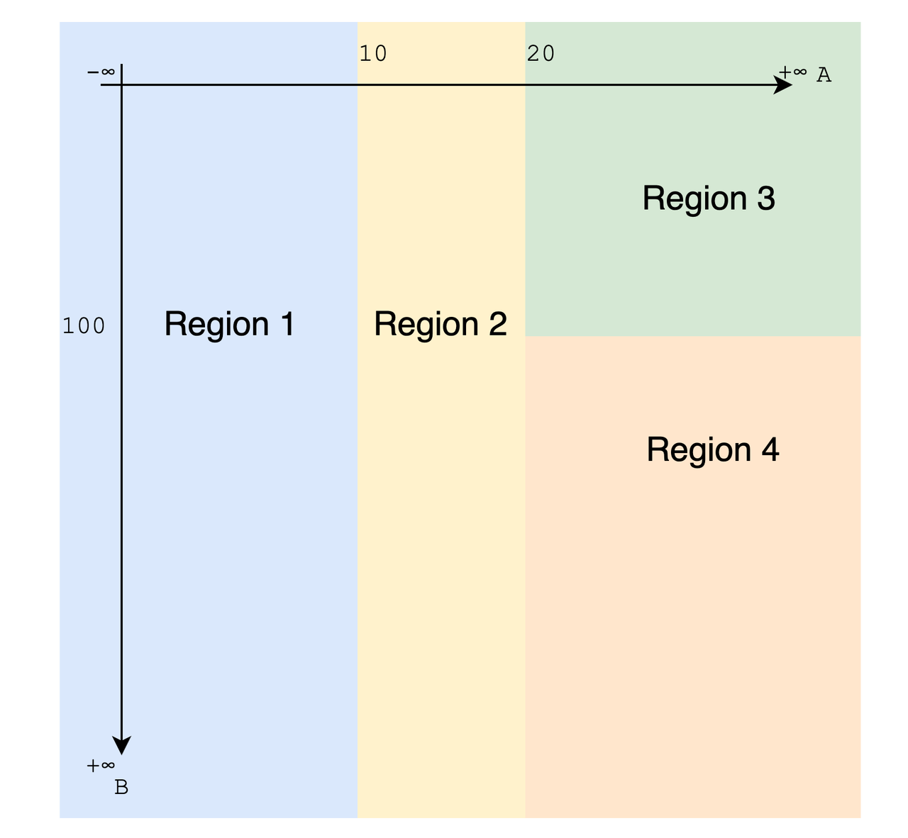
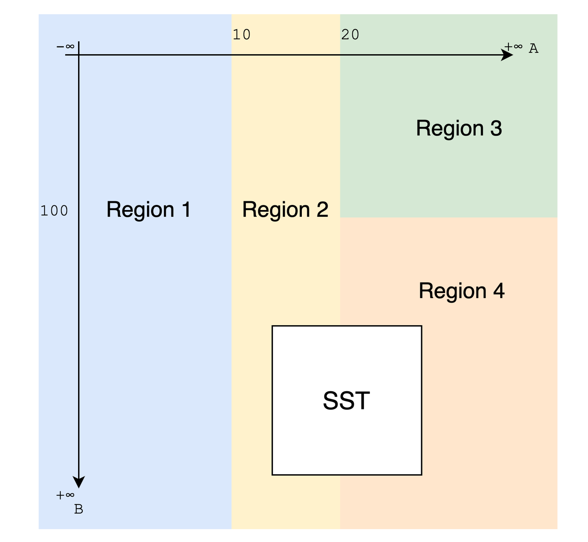

# Summary

A new region partition scheme that runs on multiple dimensions of the key space. The partition rule is defined by a set of simple expressions on the partition key columns.

# Motivation

The current partition rule is based on a single dimension. It is sort of a [Hilbert Curve](https://en.wikipedia.org/wiki/Hilbert_curve) and pick several point on the curve to divide the space. It is neither easy to understand how the data get partitioned nor flexible enough to handle complex partitioning requirements.

Considering the future requirements like region repartitioning or autonomous rebalancing, here we propose a new region partition scheme that uses a set of simple expressions on the partition key columns to divide the key space.

# Details

## Partition rule

First, we define a simple expression that can be used to define the partition rule. The simple expression is a binary expression expression on the partition key columns that can be evaluated to a boolean value. The binary operator is limited to comparison operators only, like `=`, `!=`, `>`, `>=`, `<`, `<=`. And the operands are limited either literal value or partition column.

Example of valid simple expressions are:

```latex, math
col_A \eq 10 \\
col_A \gt 10 \& col_B \gt 20 \\
col_A \ne 10 \\
```

Those expressions can be used as predicates to divide the key space into different regions. The following example have two partition columns `Col A` and `Col B`, and four partitioned regions.

```latex, math
\left\{\begin{aligned}
 
&col_A \le 10 &Region_1 \\
&10 \lt col_A \& col_A \le 20 &Region_2 \\
&20 \lt col_A \space \& \space col_B \lt 100 &Region_3 \\
&20 \lt col_A \space \& \space col_B \ge 100 &Region_4

\end{aligned}\right\}
```

An advantage of this scheme is that it is easy to understand how the data get partitioned. The above example can be visualized in a 2D space (two partition column is involved in the example).



Here each expression draws a line in the 2D space. Managing data partitioning becomes a matter of drawing lines in the key space.

## SQL interface

The SQL interface is in response to two parts: specifying the partition columns and the partition rule. Thouth we are targeting an autonomous system, it's still allowed to give some bootstrap rules or hints on creating table.

Partition column is specified by `PARTITION ON COLUMNS` sub-clause in `CREATE TABLE`:

```sql
CREATE TABLE t (...)
PARTITION ON COLUMNS (...) ();
```

Two following brackets are for partition columns and partition rule respectively.

Columns provided here are only used as an allow-list of how the partition rule can be defined. Which means (a) the sequence between columns doesn't matter, (b) the columns provided here are not necessarily being used in the partition rule.

The partition rule part is a list of comma-separated simple expressions. Expressions here are not corresponding to region, as they might be changed by system to fit various workload.

A full example of `CREATE TABLE` with partition rule is:

```sql
CREATE TABLE IF NOT EXISTS demo (
  a STRING,
  b STRING,
  c STRING,
  d STRING,
  ts TIMESTAMP,
  memory DOUBLE,
  TIME INDEX (ts),
  PRIMARY KEY (a, b, c, d)
)
PARTITION ON COLUMNS (c, b, a) (
  a < 10,
  10 >= a AND a < 20,
  20 >= a AND b < 100,
  20 >= a AND b > 100
)
```

## Combine with storage

Examining columns separately suits our columnar storage very well in two aspects.

1. The simple expression can be pushed down to storage and file format, and is likely to hit existing index. Makes pruning operation very efficient.

2. Columns in columnar storage are not tightly coupled like in the traditional row storages, which means we can easily add or remove columns from partition rule without much impact (like a global reshuffle) on data.

The data file itself can be "projected" to the key space as a polyhedron, it is guaranteed that each plane is in parallel with some coordinate planes (in a 2D scenario, this is saying that all the files can be projected to a rectangle). Thus partition or repartition also only need to consider related columns.



An additional limition is that considering how the index works and how we organize the primary keys at present, the partition columns are limited to be a subset of primary keys for better performance.

# Drawbacks

This is a breaking change.
