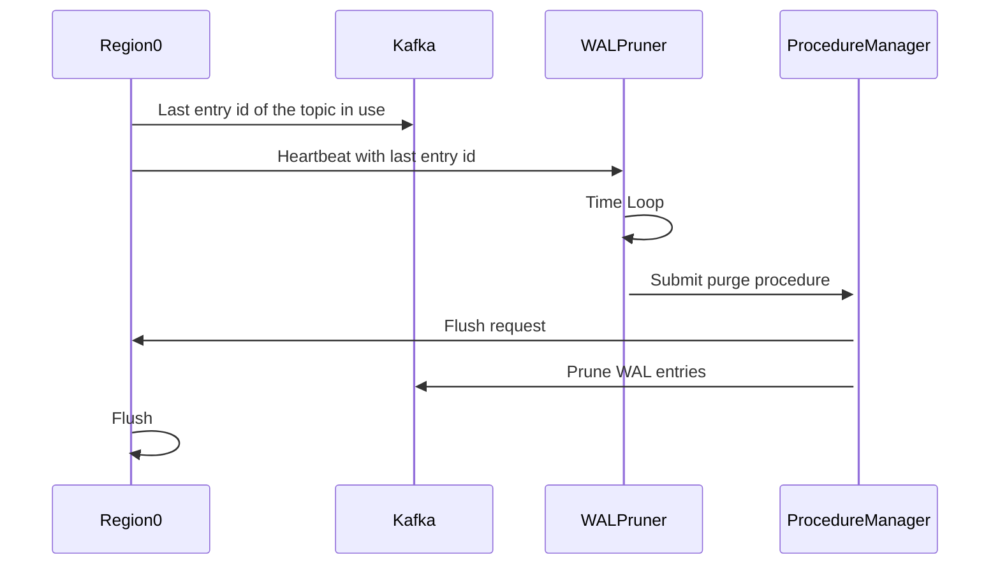

# Summary

This RFC proposes a method for purging remote WAL in the database.

# Motivation

Currently only local wal entries are purged when flushing, while remote wal does nothing.

# Details

## Steps

### Before purge

Before purging remote WAL, metasrv needs to know:

1. `last_entry_id` of each region.
2. `kafka_topic_last_entry_id` which is the last entry id of the topic in use. Can be lazily updated and needed when region has empty memtable.
3. Kafka topics that each region uses.

The states are maintained through:
1. Heartbeat: Datanode sends `last_entry_id` to metasrv in heartbeat. As for regions with empty memtable, `last_entry_id` should equals to `kafka_topic_last_entry_id`.
2. Metasrv maintains a topic-region map to know which region uses which topic.

`kafka_topic_last_entry_id` will be maintained by the region itself. Region will update the value after `k` heartbeats if the memtable is empty.

### Purge procedure

We can better handle locks utilizing current procedure. It's quite similar to the region migration procedure.

After a period of time, metasrv will submit a purge procedure to ProcedureManager. The purge will apply to all topics.

The procedure is divided into following stages:

1. Preparation:
   - Retrieve `last_entry_id` of each region kvbackend.
   - Choose regions that have a relatively small `last_entry_id` as candidate regions, which means we need to send a flush request to these regions.
2. Communication:
   - Send flush requests to candidate regions.
3. Purge:
   - Choose proper entry id to delete for each topic. The entry should be the smallest `last_entry_id - 1` among all regions. 
   - Delete legacy entries in Kafka.
   - Store the `last_purged_entry_id` in kvbackend. It should be locked to prevent other regions from replaying the purged entries.

### After purge

After purge, there may be some regions that have `last_entry_id` smaller than the entry we just deleted. It's legal since we only delete the entries that are not needed anymore.

When restarting a region, it should query the `last_purged_entry_id` from metasrv and replay from `min(last_entry_id, last_purged_entry_id)`.

### Error handling

No persisted states are needed since all states are maintained in kvbackend.

Retry when failed to retrieving metadata from kvbackend.

# Alternatives

Purge time can depend on the size of the WAL entries instead of a fixed period of time, which may be more efficient.
