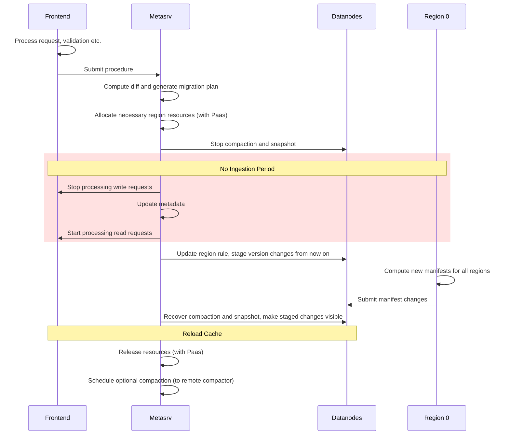

# Summary

This RFC proposes a method for repartitioning a table, to adjust the partition rule and data distribution.

# Motivation

With time passing, the data distribution and skew pattern of a table might change. We need a way to repartition the table to suit the new pattern.

# Details

Here is a rough workflow diagram of the entire repartition process, each step is described in detail below.

## Preprocessing

This phase is for static analysis of the new partition rule. The server can know whether the repartitioning is possible, how to do the repartitioning, and how much resources are needed.

In theory, the input and output partition rules for repartitioning can be completely unrelated. But in practice, to avoid a very large change set, we'll only allow two simple kinds of change. One splits one region into two regions (region split) and another merges two regions into one (region merge).

After validating the new partition rule using the same validation logic as table creation, we compute the difference between the old and new partition rules. The resulting diff may contain several independent groups of changes. During subsequent processing, each group of changes can be handled independently and can succeed or fail without affecting other groups or creating non-idempotently retryable scenarios.

Next, we generate a repartition plan for each group of changes. Each plan contains this information for all regions involved in that particular plan. And one target region will only be referenced by a single plan.

With those plans, we can determine the resource requirements for the repartition operation, where resources here primarily refer to Regions. Metasrv will coordinate with PaaS layer to pre-allocate the necessary regions at this stage. These new regions start completely empty, and their metadata and manifests will be populated during subsequent modification steps.

## Data Processing

This phase is primarily for region's change, including region's metadata (route table and the corresponding rule) and manifest.

Once we start processing one plan through a procedure, we'll first stop the region's compaction and snapshot. This is to avoid any states being removed due to compaction (which may removes old SST files) and snapshot (which may removes old manifest files).

Metasrv will trying to update the metadata of partition, or the region route table (related to `PartitionRuleManager`). This step is in the "no ingestion" scope, so no new data will be ingested. Since this won't take much time, the affection to the cluster is minimized. Metasrv will also update the region rule to corresponding regions on Datanodes. 

Every regions and all the ingestion requests to the region server will have a version of region rule, to identify under which rule the request is processed. The version can be something like `hash(region_rule)`. Once the region rule on region server is updated, all ingestion request with old rule will be rejected, and all requests with new rule will be accepted but not visible. They can still be flushed to persisted storage, but their version change (new manifest) will be staged.

Then region 0 (or let metasrv to pick any operational region) will compute the new manifests for all target regions. This step is done by first reading all old manifests, and remapping the files with new partition rule, to get the content of new manifests. Notice this step only handles the manifests before region rule change on region server, and won't touch those staged manifests, as they are already with the new rule.

Those new manifest will be submitted to the corresponding target regions by region 0 via a `RegionEdit` request. If this request falls after a few retries, region 0 will try to rollback this change by directly overwriting the manifest on object storage. and report this failure to metasrv and let the entire repartition procedure to fail. And we can also optionally compute the new manifest for those staged version changes (like another repartition) and submit them to the target regions to make the also visible even if the repartition fails.

In the other hand, a successful `RegionEdit` request also acknowledges those staged version changes and make them visible.

After this step, the repartition is done in the data plane. We can start to process compaction and snapshot again.

## Postprocessing

After the main processing is done, we can do some extra postprocessing to reduce the performance impact of repartition. Including reloading caches in frontend's route table, metasrv's kv cache and datanode's read/write/page cache etc.

We can also schedule an optional compaction to reorganize all the data file under the new partition rule to reduce potential fragmentation or read amplification.

## Procedure

Here describe the repartition procedure step by step:

- <on frontend> Validating repartition request
- <on frontend> Initialize the repartition procedure
- Calculate rule diff and repartition plan group
- Allocate necessary new regions
- Lock the table key
- For each repartition subprocedure
  - Stop compaction and snapshot
  - Forbid new ingestion requests, update metadata, allow ingestion requests.
  - Update region rule to regions
  - Pick one region to calculate new manifest for all regions in this repartition group
  - Let that region to apply new manifest to each region via `RegionEdit`
  - If failed after some retries, revert this manifest change to other succeeded regions and mark this failure.
  - If all succeeded, acknowledge those staged version changes and make them visible.
  - Return result
- Collect results from subprocedure.
  - For those who failed, we need to restart those regions to force reconstruct their status from manifests
  - For those who succeeded, collect and merge their rule diff
- Unlock the table key
- Report the result to user.
- <in background> Reload cache
- <in background> Maybe trigger a special compaction

In addition of sequential step, rollback is also an important part of this procedure. There are three steps can be rolled back when unrecoverable failure occurs.

If the metadata update is not committed, we can overwrite the metadata to previous version. This step is scoped in the "no ingestion" period, so no new data will be ingested and the status of both datanode and metasrv will be consistent.

If the `RegionEdit` to other regions is not acknowledged, or partial acknowledged, we can directly overwrite the manifest on object storage from the central region (who computes the new manifest), and force region server to reload corresponding region to load its state from object storage to recover.

If the staged version changes are not acknowledged, we can re-compute manifest based on old rule for staged data, and apply them directly like above. This is like another smaller repartition for those staged data.

## Region rule validation and diff calculation

In the current codebase, the rule checker is not complete. It can't check uniqueness and completeness of the rule. This RFC also propose a new way to validate the rule.

The proposed validation way is based on a check-point system, which first generates a group of check-points from the rule, and then check if all the point is covered and only covered by one rule.

All the partition rule expressionis limited to be the form of `<column> <operator> <value>`, and the operator is limited to be comparison operators. Those expressions are allowed to be nested with `AND` and `OR` operators. Based on this, we can first extract all the unique values on each column, adding and subtracting a little epsilon to cover its left and right boundary.

Since we accept integer, float and string as the value type, compute on them directly is not convenient. So we'll first normalize them to a common type and only need to preserve the relative partial ordering. This also avoids the problem of "what is next/previous value" of string and "what's a good precision" for float.

After normalization, we get a set of scatter points for each column. Then we can generate a set of check-points by combining all the scatter points like building a cartesian product. This might bring a large number of check-points, so we can do an prune optimization to remove some of them by merging some of the expression zones. Those expressions who have identical N-1 edge sub-expressions with one adjacent edge can be merged together. This prune check is with a time complexity of O(N * M * log(M)), where N is the number of active dimensions and M is the number of expression zones. Diff calculation is also done by finding different expression zones between the old and new rule set, and check if we can transform one to another by merging some of the expression zones.

The step to validate the check-points set against expressions can be treated as a tiny expression of `PhysicalExpr`. This evaluation will give a boolean matrix of K*M shape, where K is the number of check-points. We then check in each row of the matrix, if there is one and only one true value.

## Compute and use new manifest

We can generate a new set of manifest file based on old manifest and two versions of rule. From abvoe rule processing part, we can tell how a new rule & region is from previous one. So a simple way to get the new manifest is also apply the step of change to manifest files. E.g., if region A is from region B and C, we simply combine all file IDs from B and C to generate the content of A.

If necessary, we can do this better by involving some metadata related to data, like min-max statistics of each file, and pre-evaluate over min-max to filter out unneeded files when generating new manifest.

The way to use new manifest needs one more extra step based on the current implementation. We'll need to record either in manifest or in file metadata, of what rule is used when generating (flush or compaction) a SST file. Then in every single read request, we need to append the current region rule as predicate to the read request, to ensure no data belong to other regions will be read. We can use the stored region rule to reduce the number of new predicates to apply, by removing the identical predicate between the current region rule and the stored region rule. So ideally in a table that has not been repartitioned recently, the overhead of checking region rule is minimal.

## Pre-required tasks

In above steps, we assume some functionalities are implemented. Here list them with where they are used and how to implement them.

### Cross-region read

The current data directory structure is `{table_id}/{region_id}/[data/metadata]/{file_id}`, every region can only access files under their own directory. After repartition, data file may be placed in other previous old regions. So we need to support cross-region read. This new access method allows region to access any file under the same table. Related tracking issue is <https://github.com/GreptimeTeam/greptimedb/issues/6409>.

### Global GC worker

This is to simplify state management of data files. As one file may be referenced in multiple manifests, or no manifest at all. After this, every region and the repartition process only need to care about generateing and using new files, without tracking whether a file should be deleted or not. Leaving the deletion to the global GC worker. This worker basically works by counting reference from manifest file, and remove unused one. Related tracking issue is **TBD**.

# Alternatives

In the "Data Processing" section, we can enlarge the "no ingestion" period to include almost all the steps. This can simplify the entire procedure by a lot, but will bring a longer time of ingestion pause which may not be acceptable.
