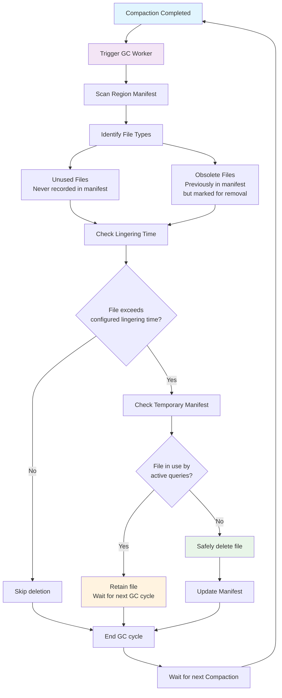
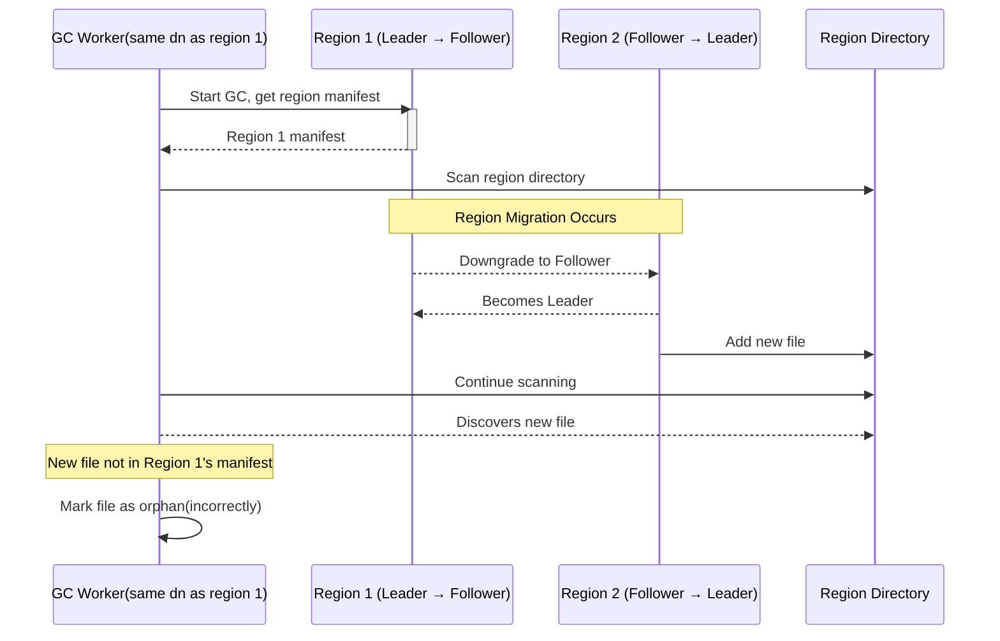

# Global GC Worker

## Summary

This RFC proposes the integration of a garbage collection (GC) mechanism within the Compaction process. This mechanism aims to manage and remove stale files that are no longer actively used by any system component, thereby reclaiming storage space.

## Motivation

With the introduction of features such as table repartitioning, a substantial number of Parquet files can become obsolete. Furthermore, failures during manifest updates may result in orphaned files that are never referenced by the system. Therefore, a periodic garbage collection mechanism is essential to reclaim storage space by systematically removing these unused files.

## Details

### Overview

The garbage collection process will be integrated directly into the Compaction process. Upon the completion of a Compaction for a given region, the GC worker will be automatically triggered. Its primary function will be to identify and subsequently delete obsolete files that have persisted beyond their designated retention period. This integration ensures that garbage collection is performed in close conjunction with data lifecycle management, effectively leveraging the compaction process's inherent knowledge of file states.

This design prioritizes correctness and safety by explicitly linking GC execution to a well-defined operational boundary: the successful completion of a compaction cycle.

### Terminology

- **Unused File**: Refers to a file present in the storage directory that has never been formally recorded in any manifest. A common scenario for this includes cases where a new SST file is successfully written to storage, but the subsequent update to the manifest fails, leaving the file unreferenced.
- **Obsolete File**: Denotes a file that was previously recorded in a manifest but has since been explicitly marked for removal. This typically occurs following operations such as data repartitioning or compaction.

### GC Worker Process

The GC worker operates as an integral part of the Compaction process. Once a Compaction for a specific region is completed, the GC worker is automatically triggered. Executing this process on a `datanode` is preferred to eliminate the overhead associated with having to set object storage configurations in the `metasrv`.

The detailed process is as follows:

1.  **Invocation**: Upon the successful completion of a Compaction for a region, the GC worker is invoked.
2.  **Manifest Reading**: The worker reads the region's primary manifest to obtain a comprehensive list of all files marked as obsolete. Concurrently, it reads any temporary manifests generated by long-running queries to identify files that are currently in active use, thereby preventing their premature deletion.
3.  **Lingering Time Check (Obsolete Files)**: For each identified obsolete file, the GC worker evaluates its "lingering time." Which is the time passed after it had been removed from manifest.
4.  **Deletion Marking (Obsolete Files)**: Files that have exceeded their maximum configurable lingering time and are not referenced by any active temporary manifests are marked for deletion.
5.  **Lingering Time (Unused Files)**: Unused files (those never recorded in any manifest) are also subject to a configurable maximum lingering time before they are eligible for deletion.

Following flowchart illustrates the GC worker's process:

#### Handling Obsolete Files

An obsolete file is permanently deleted only if two conditions are met:
1. The time elapsed since its removal from the manifest (its obsolescence timestamp) exceeds a configurable threshold.
2. It is not currently referenced by any active temporary manifests.

#### Handling Unused Files

With the integration of the GC worker into the Compaction process, the risk of accidentally deleting newly created SST files that have not yet been recorded in the manifest is significantly mitigated. Consequently, the concept of "Unused Files" as a distinct category primarily susceptible to accidental deletion is largely resolved. Any files that are genuinely "unused" (i.e., never referenced by any manifest, including temporary ones) can be safely deleted after a configurable maximum lingering time.

For debugging and auditing purposes, a comprehensive list of recently deleted files can be maintained.

### Ensuring Read Consistency

To prevent the GC worker from inadvertently deleting files that are actively being utilized by long-running analytical queries, a robust protection mechanism is introduced. This mechanism relies on temporary manifests that are actively kept "alive" by the queries using them.

When a long-running query is detected (e.g., by a slow query recorder), it will write a temporary manifest to the region's manifest directory. This manifest lists all files required for the query. However, simply creating this file is not enough, as a query runner might crash, leaving the temporary manifest orphaned and preventing garbage collection indefinitely.

To address this, the following "heartbeat" mechanism is implemented:
1.  **Periodic Updates**: The process executing the long-running query is responsible for periodically updating the modification timestamp of its temporary manifest file (i.e., "touching" the file). This serves as a heartbeat, signaling that the query is still active.
2.  **GC Worker Verification**: When the GC worker runs, it scans for temporary manifests. For each one it finds, it checks the file's last modification time.
3.  **Stale File Handling**: If a temporary manifest's last modification time is older than a configurable threshold, the GC worker considers it stale (left over from a crashed or terminated query). The GC worker will then delete this stale temporary manifest. Files that were protected only by this stale manifest are no longer shielded from garbage collection.

This approach ensures that only files for genuinely active queries are protected. The lifecycle of the temporary manifest is managed dynamically: it is created when a long query starts, kept alive through periodic updates, and is either deleted by the query upon normal completion or automatically cleaned up by the GC worker if the query terminates unexpectedly.

This mechanism may be too complex to implement at once. We can consider a two-phased approach:
1.  **Phase 1 (Simple Time-Based Deletion)**: Initially, implement a simpler GC strategy that deletes obsolete files based solely on a configurable lingering time. This provides a baseline for space reclamation without the complexity of temporary manifests.
2.  **Phase 2 (Consistency-Aware GC)**: Based on the practical effectiveness and observed issues from Phase 1, we can then decide whether to implement the full temporary manifest and heartbeat mechanism to handle long-running queries. This iterative approach allows for a quicker initial implementation while gathering real-world data to justify the need for a more complex solution.

## Drawbacks

- **Dependency on Compaction Frequency**: The integration of the GC worker with Compaction means that GC cycles are directly tied to the frequency of compactions. In environments with infrequent compaction operations, obsolete files may accumulate for extended periods before being reclaimed, potentially leading to increased storage consumption.
- **Race Condition with Long-Running Queries**: A potential race condition exists if a long-running query initiates but haven't write its temporary manifest in time, while a compaction process simultaneously begins and marks files used by that query as obsolete. This scenario could lead to the premature deletion of files still required by the active query. To mitigate this, the threshold time for writing a temporary manifest should be significantly shorter than the lingering time configured for obsolete files, ensuring that next GC worker runs do not delete files that are now referenced by a temporary manifest if the query is still running.
Also the read replica shouldn't be later in manifest version for more than the lingering time of obsolete files, otherwise it might ref to files that are already deleted by the GC worker.
- need to upload tmp manifest to object storage, which may introduce additional complexity and potential performance overhead. But since long-running queries are typically not frequent, the performance impact is expected to be minimal.

one potential race condition with region-migration is illustrated below:

which could cause gc worker to incorrectly mark the new file as orphan and delete it, if config the lingering time for orphan files(files not mentioned anywhere(in used or unused)) is not long enough.

A good enough solution could be to use lock to prevent gc worker to happen on the region if region migration is happening on the region, and vise versa.

The race condition between gc worker and repartition also needs to be considered carefully. For now, acquiring lock for both region-migration and repartition during gc worker process could be a simple solution.

## Conclusion and Rationale

This section summarizes the key aspects and trade-offs of the proposed integrated GC worker, highlighting its advantages and potential challenges.

| Aspect | Current Proposal (Integrated GC) |
| :--- | :--- |
| **Implementation Complexity** | **Medium**. Requires careful integration with the compaction process and the slow query recorder for temporary manifest management. |
| **Reliability** | **High**. Integration with compaction and leveraging temporary manifests from long-running queries significantly mitigates the risk of incorrect deletion. Accurate management of lingering times for obsolete files and prevention of accidental deletion of newly created SSTs enhance data safety. |
| **Performance Overhead** | **Low to Medium**. The GC worker runs post-compaction, minimizing direct impact on write paths. Overhead from temporary manifest management by the slow query recorder is expected to be acceptable for long-running queries. |
| **Impact on Other Components** | **Moderate**. Requires modifications to the compaction process to trigger GC and the slow query recorder to manage temporary manifests. This introduces some coupling but enhances overall data safety. |
| **Deletion Strategy** | **State- and Time-Based**. Obsolete files are deleted based on a configurable lingering time, which is paused if the file is referenced by a temporary manifest. Unused files (never in a manifest) are also subject to a lingering time. |

## Unresolved Questions and Future Work

This section outlines key areas requiring further discussion and defines potential avenues for future development.

*   **Slow Query Recorder Implementation**: Detailed specifications for modify slow query recorder's implementation and its precise interaction mechanisms with temporary manifests are needed.
*   **Configurable Lingering Times**: Establish and make configurable the specific lingering times for both obsolete and unused files to optimize storage reclamation and data availability.

## Alternatives

### 1. Standalone GC Service

Instead of integrating the GC worker directly into the Compaction process, a standalone GC service could be implemented. This service would operate independently, periodically scanning the storage for obsolete and unused files based on manifest information and predefined retention policies.

**Pros:**
*   **Decoupling**: Separates GC logic from compaction, allowing independent scaling and deployment.
*   **Flexibility**: Can be configured to run at different frequencies and with different strategies than compaction.

**Cons:**
*   **Increased Complexity**: Requires a separate service to manage, monitor, and coordinate with other components.
*   **Potential for Redundancy**: May duplicate some file scanning logic already present in compaction.
*   **Consistency Challenges**: Ensuring read consistency would require more complex coordination mechanisms between the standalone GC service and active queries, potentially involving a distributed lock manager or a more sophisticated temporary manifest system.

This alternative could be implemented in the future if the integrated GC worker proves insufficient or if there is a need for more advanced GC strategies.

### 2. Manifest-Driven Deletion (No Lingering Time)

This alternative would involve immediate deletion of files once they are removed from the manifest, without a lingering time.

**Pros:**
*   **Simplicity**: Simplifies the GC logic by removing the need for lingering time management.
*   **Immediate Space Reclamation**: Storage space is reclaimed as soon as files are marked for deletion.

**Cons:**
*   **Increased Risk of Data Loss**: Higher risk of deleting files still in use by long-running queries or other processes if not perfectly synchronized.
*   **Complex Read Consistency**: Requires extremely robust and immediate mechanisms to ensure that no active queries are referencing files marked for deletion, potentially leading to performance bottlenecks or complex error handling.
*   **Debugging Challenges**: Difficult to debug issues related to premature file deletion due to the immediate nature of the operation.
