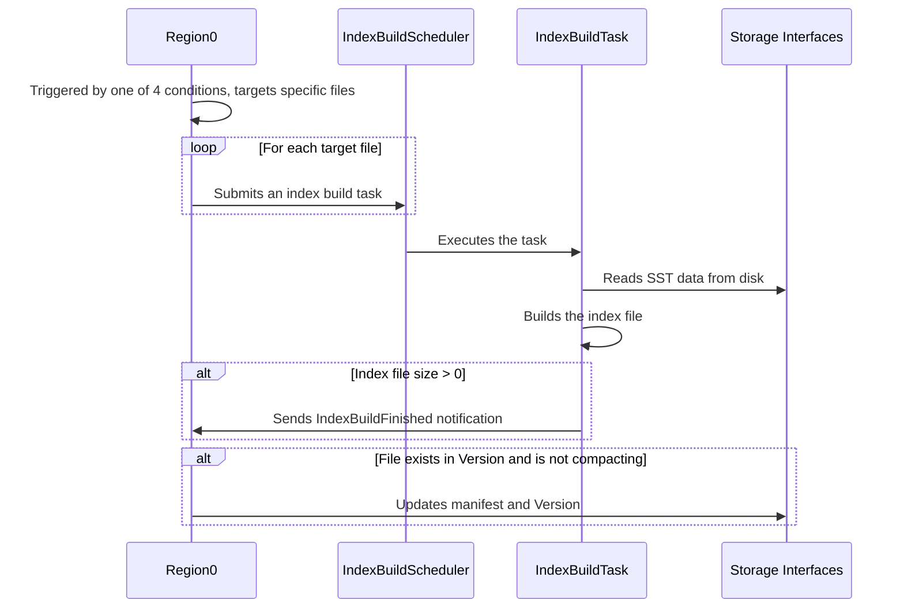

# Summary
This RFC proposes an asynchronous index build mechanism in the database, with a configuration option to choose between synchronous and asynchronous modes, aiming to improve flexibility and adapt to different workload requirements.

# Motivation
Currently, index creation is performed synchronously, which may lead to prolonged write suspension and impact business continuity. As data volume grows, the time required for index building increases significantly. An asynchronous solution is urgently needed to enhance user experience and system throughput.

# Details

## Overview

The following table highlights the difference between async and sync index approach:

| Approach | Trigger | Data Source | Additional Index Metadata Installation | Fine-grained `FileMeta` Index |
| :--- | :--- | :--- | :--- | :--- |
| Sync Index | On `write_sst` | Memory (on flush) / Disk (on compact) | Not required(already installed synchronously) | Not required |
| Async Index | 4 trigger types | Disk | Required | Required |

The index build mode (synchronous or asynchronous) can be selected via configuration file. 

### Four Trigger Types

This RFC introduces four `IndexBuildType`s to trigger index building:

- **Manual Rebuild**: Triggered by the user via `ADMIN build_index("table_name")`, for scenarios like recovering from failed builds or migrating data
- **Schema Change**: Automatically triggered when the schema of an indexed column is altered.
- **Flush**: Automatically builds indexes for new SST files created by a flush.
- **Compact**: Automatically builds indexes for new SST files created by a compaction.

### Additional Index Metadata Installation

Previously, index information in the in-memory `FileMeta` was updated synchronously. The async approach requires an explicit installation step.

A race condition can occur when compaction and index building run concurrently, leading to:
1. Building an index for a file that is about to be deleted by compaction.
2. Creating an unnecessary index file and an incorrect manifest record.
3. On restart, replaying the manifest could load metadata for a non-existent file.

To prevent this, the system checks if a file's `FileMeta` is in a `compacting` state before updating the manifest. If it is, the installation is aborted.

### Fine-grained `FileMeta` Index

The original `FileMeta` only stored file-level index information. However, manual rebuilds require column-level details to identify files inconsistent with the current DDL. Therefore, the `indexes` field in `FileMeta` is updated as follows:
```rust
struct FileMeta {
    ...
    // From file-level:
    // available_indexes: SmallVec<[IndexType; 4]>
    // To column-level:
    indexes: Vec<ColumnIndexMetadata>,
    ...
}
pub struct ColumnIndexMetadata {
    pub column_id: ColumnId,
    pub created_indexes: IndexTypes,
}
```

## Process

The index building process is similar to a flush and is illustrated below:



### Task Triggering and Scheduling

The process starts with one of the four `IndexBuildType` triggers. In `handle_rebuild_index`, the `RegionWorkerLoop` identifies target SSTs from the request or the current region version. It then creates an `IndexBuildTask` for each file and submits it to the `index_build_scheduler`.

Similar to Flush and Compact operations, index build tasks are ultimately dispatched to the LocalScheduler. Resource usage can be adjusted via configuration files. Since asynchronous index tasks are both memory-intensive and IO-intensive but have lower priority, it is recommended to allocate fewer resources to them compared to compaction and flush tasks—for example, limiting them to 1/8 of the CPU cores. 

### Index Building and Notification

The scheduled `IndexBuildTask` executes its `index_build` method. It uses an `indexer_builder` to create an `Indexer` that reads SST data and builds the index. If a new index file is created (`IndexOutput.file_size > 0`), the task sends an `IndexBuildFinished` notification back to the `RegionWorkerLoop`.

### Index Metadata Installation

Upon receiving the `IndexBuildFinished` notification in `handle_index_build_finished`, the `RegionWorkerLoop` verifies that the file still exists in the current `version` and is not being compacted. If the check passes, it calls `manifest_ctx.update_manifest` to apply a `RegionEdit` with the new index information, completing the installation.

# Drawbacks

Asynchronous index building may consume extra system resources, potentially affecting overall performance during peak periods.

There may be a delay before the new index becomes available for queries, which could impact certain use cases.

# Unresolved Questions and Future Work

**Resource Management and Throttling**: The resource consumption (CPU, I/O) of background index building can be managed and limited to some extent by configuring a dedicated background thread pool. However, this approach cannot fully eliminate resource contention, especially under heavy workloads or when I/O is highly competitive. Additional throttling mechanisms or dynamic prioritization may still be necessary to avoid impacting foreground operations.

# Alternatives

Instead of being triggered by events like Flush or Compact, index building could be performed in batches during scheduled maintenance windows. This offers predictable resource usage but delays index availability.