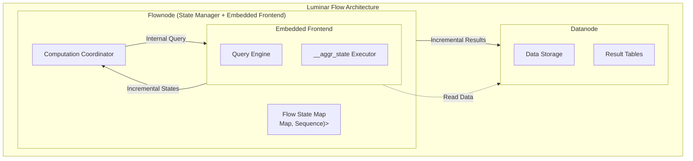
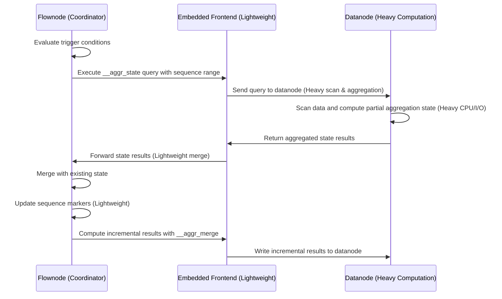
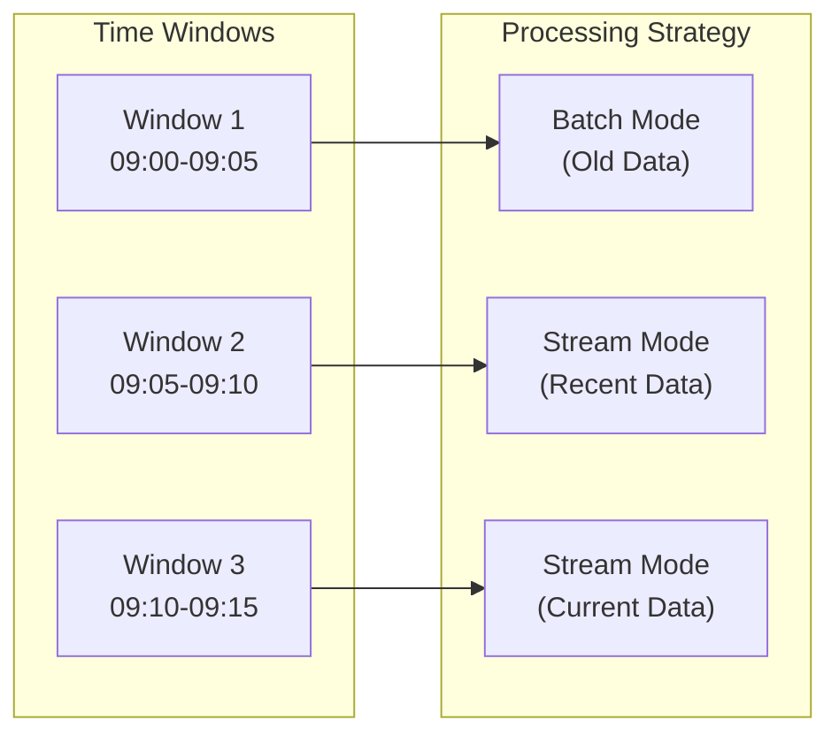

# Luminar Flow

## Summary

This RFC proposes a redesign of the flow architecture where flownode becomes a lightweight in-memory state management node with an embedded frontend for direct computation. This approach optimizes resource utilization and improves scalability by eliminating network hops while maintaining clear separation between coordination and computation tasks.

## Motivation

The current flow architecture has several limitations:

1. **Resource Inefficiency**: Flownodes perform both state management and computation, leading to resource duplication and inefficient utilization.
2. **Scalability Constraints**: Computation resources are tied to flownode instances, limiting horizontal scaling capabilities.
3. **State Management Complexity**: Mixing computation with state management makes the system harder to maintain and debug.
4. **Network Overhead**: Additional network hops between flownode and separate frontend nodes add latency.

The Luminar Flow architecture addresses these issues by:
- Consolidating computation within flownode through embedded frontend
- Eliminating network overhead by removing separate frontend node communication
- Simplifying state management by focusing flownode on its core responsibility
- Improving system scalability and maintainability

## Details

### Architecture Overview

The Luminar Flow architecture transforms flownode into a lightweight coordinator that maintains flow state with an embedded frontend for computation. The key components involved are:

1. **Flownode**: Maintains in-memory state, coordinates computation, and includes an embedded frontend for query execution
2. **Embedded Frontend**: Executes **incremental** computations within the flownode
3. **Datanode**: Stores final results and source data



### Core Components

#### 1. Flow State Management

Flownode maintains a state map for each flow:

```rust
type FlowState = Map<Timestamp, (Map<Key, Value>, Sequence)>;
```

Where:
- **Timestamp**: Time window identifier for aggregation groups
- **Key**: Aggregation group expressions (`group_exprs`)
- **Value**: Aggregation expressions results (`aggr_exprs`)
- **Sequence**: Computation progress marker for incremental updates

#### 2. Incremental Computation Process

The computation process follows these steps:

1. **Trigger Evaluation**: Flownode determines when to trigger computation based on:
   - Time intervals (periodic updates)
   - Data volume thresholds
   - Sequence progress requirements

2. **Query Execution**: Flownode executes `__aggr_state` queries using its embedded frontend with:
   - Time window filters
   - Sequence range constraints

3. **State Update**: Flownode receives partial state results and updates its internal state:
   - Merges new values with existing aggregation state
   - Updates sequence markers to track progress
   - Identifies changed time windows for result computation

4. **Result Materialization**: Flownode computes final results using `__aggr_merge` operations:
   - Processes only updated time windows(and time series) for efficiency
   - Writes results back to datanode directly through its embedded frontend

### Detailed Workflow

#### Incremental State Query

```sql
-- Example incremental state query executed by embedded frontend
SELECT
    __aggr_state(avg(value)) as state,
    time_window,
    group_key
FROM source_table
WHERE
    timestamp >= :window_start
    AND timestamp < :window_end
    AND __sequence >= :last_sequence
    AND __sequence < :current_sequence
    -- sequence range is actually written in grpc header, but shown here for clarity
GROUP BY time_window, group_key;
```

#### State Merge Process



### Refill Implementation and State Management

#### Refill Process

Refill is implemented as a straightforward `__aggr_state` query with time and sequence constraints:

```sql
-- Refill query for flow state recovery
SELECT 
    __aggr_state(aggregation_functions) as state,
    time_window,
    group_keys
FROM source_table 
WHERE 
    timestamp >= :refill_start_time 
    AND timestamp < :refill_end_time
    AND __sequence >= :start_sequence 
    AND __sequence < :end_sequence
    -- sequence range is actually written in grpc header, but shown here for clarity
GROUP BY time_window, group_keys;
```

#### State Recovery Strategy

1. **Recent Data (Stream Mode)**: For recent time windows, flownode refills state using incremental queries
2. **Historical Data (Batch Mode)**: For older time windows, flownode triggers batch computation directly and no need to refill state
3. **Hybrid Approach**: Combines stream and batch processing based on data age and availability

#### Mirror Write Optimization

Mirror writes are simplified to only transmit timestamps to flownode:

```rust
struct MirrorWrite {
    timestamps: Vec<Timestamp>,
    // Removed: actual data payload
}
```

This optimization:
- Eliminates network overhead by using embedded frontend
- Enables flownode to track pending time windows efficiently
- Allows flownode to decide processing mode (stream vs batch) based on timestamp age

Another optimization could be just send dirty time windows range for each flow to flownode directly, no need to send timestamps one by one.

### Query Optimization Strategies

#### Sequence-Based Incremental Processing

The core optimization relies on sequence-constrained queries:

```sql
-- Optimized incremental query
SELECT __aggr_state(expr) 
FROM table 
WHERE time_range AND sequence_range
```

Benefits:
- **Reduced Scan Volume**: Only processes data since last computation
- **Efficient Resource Usage**: Minimizes CPU and I/O overhead
- **Predictable Performance**: Query cost scales with incremental data size

#### Time Window Partitioning



### Performance Characteristics

#### Memory Usage

- **Flownode**: O(active_time_windows × group_cardinality) for state storage
- **Embedded Frontend**: O(query_batch_size) for temporary computation
- **Overall**: Significantly reduced compared to current architecture

#### Computation Distribution

- **Direct Processing**: Queries processed directly within flownode's embedded frontend
- **Fault Tolerance**: Simplified error handling with fewer distributed components
- **Scalability**: Computation capacity scales with flownode instances

#### Network Optimization

- **Reduced Payload**: Mirror writes only contain timestamps
- **Efficient Queries**: Sequence constraints minimize data transfer
- **Result Caching**: State results cached in flownode memory

## Implementation Plan

### Phase 1: Core Infrastructure

1. **State Management**: Implement in-memory state map in flownode
2. **Query Interface**: Integrate `__aggr_state` query interface in embedded frontend(Already done in previous query pushdown optimizer work)
3. **Basic Coordination**: Implement query dispatch and result collection
4. **Sequence Tracking**: Implement sequence-based incremental processing(Can use similar interface which leader range read use)

After phase 1, the system should support basic flow operations with incremental updates.

### Phase 2: Optimization Features

1. **Refill Logic**: Develop state recovery mechanisms
2. **Mirror Write Optimization**: Simplify mirror write protocol

### Phase 3: Advanced Features

1. **Load Balancing**: Implement intelligent resource allocation for partitioned flow(Flow distributed executed on multiple flownodes)
2. **Fault Tolerance**: Add retry mechanisms and error handling
3. **Performance Tuning**: Optimize query batching and state management

## Drawbacks

### Reduced Network Communication

- **Eliminated Hops**: Direct communication between flownode and datanode through embedded frontend
- **Reduced Latency**: No separate frontend node communication overhead
- **Simplified Network Topology**: Fewer network dependencies and failure points

### Complexity in Error Handling

- **Distributed Failures**: Need to handle failures across multiple components
- **State Consistency**: Ensuring state consistency during partial failures
- **Recovery Complexity**: More complex recovery procedures

### Datanode Resource Requirements

- **Computation Load**: Datanode handles the heavy computational workload for flow queries
- **Query Interference**: Flow queries may impact regular query performance on datanode
- **Resource Contention**: Need careful resource management and isolation on datanode

## Alternatives

### Alternative 1: Enhanced Current Architecture

Keep computation in flownode but optimize through:
- Better resource management
- Improved query optimization
- Enhanced state persistence

**Pros:**
- Simpler architecture
- Fewer network hops
- Easier debugging

**Cons:**
- Limited scalability
- Resource inefficiency
- Harder to optimize computation distribution

### Alternative 2: Embedded Computation

Embed lightweight computation engines within flownode:

**Pros:**
- Reduced network communication
- Better performance for simple queries
- Simpler deployment

**Cons:**
- Limited scalability
- Resource constraints
- Harder to leverage existing frontend optimizations

## Future Work

### Advanced Query Optimization

- **Parallel Processing**: Enable parallel execution of flow queries
- **Query Caching**: Cache frequently executed query patterns

### Enhanced State Management

- **State Compression**: Implement efficient state serialization
- **Distributed State**: Support state distribution across multiple flownodes
- **State Persistence**: Add optional state persistence for durability

### Monitoring and Observability

- **Performance Metrics**: Track query execution times and resource usage
- **State Visualization**: Provide tools for state inspection and debugging
- **Health Monitoring**: Monitor system health and performance characteristics

### Integration Improvements

- **Embedded Frontend Optimization**: Optimize embedded frontend query planning and execution
- **Datanode Optimization**: Optimize result writing from flownode
- **Metasrv Coordination**: Enhanced metadata management and coordination

## Conclusion

The Luminar Flow architecture represents a significant improvement over the current flow system by separating state management from computation execution. This design enables better resource utilization, improved scalability, and simplified maintenance while maintaining the core functionality of continuous aggregation.

The key benefits include:

1. **Improved Scalability**: Computation can scale independently of state management
2. **Better Resource Utilization**: Eliminates network overhead and leverages embedded frontend infrastructure
3. **Simplified Architecture**: Clear separation of concerns between components
4. **Enhanced Performance**: Sequence-based incremental processing reduces computational overhead

While the architecture introduces some complexity in terms of distributed coordination and error handling, the benefits significantly outweigh the drawbacks, making it a compelling evolution of the flow system.