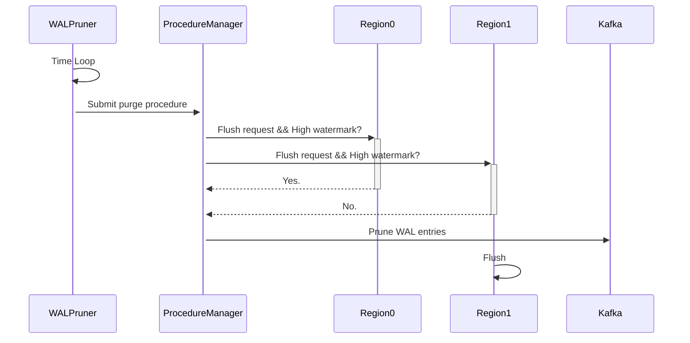

# Summary

This RFC proposes a method for purging remote WAL in the database.

# Motivation

Currently only local wal entries are purged when flushing, while remote wal does nothing.

# Details

## Steps

### Before purge

Before purging remote WAL, metasrv needs to know:

1. `last_entry_id` of each region.
2. Kafka topics that each region uses.

The states are maintained through:
1. Heartbeat: Datanode sends `last_entry_id` to metasrv in heartbeat.
2. Metasrv maintains a topic-region map to know which region uses which topic.

### Purge procedure

We can better handle locks utilizing current procedure. It's quite similar to the region migration procedure.

During purge, the procedure should hold a lock to prevent other procedures from modifying the topic-region map of existing regions, which only happens when dropping tables currently.

After a period of time, metasrv will submit a purge procedure to ProcedureManager. The purge will apply to all topics.

The procedure is divided into following stages:

1. Preparation:
   - Retrive `last_entry_id` of each region kvbackend.
   - Choose regions that have a relatively small `last_entry_id` as candidate regions, which means we need to send a flush request to these regions.
2. Communication:
   - Send flush requests to candidate regions.
   - Send high watermarks check requests to candidate regions to check if they have nothing to flush. This is to avoid following case:
     - The region has been idle for a long time, and the `last_entry_id` is low. Flush request will not take effect for the region but we can still delete the WAL entries.
   - Wait for responses only for check requests. We don't need to wait for flush requests since it may take a long time and we can handle it in the next purge.
3. Purge:
   - Choose proper entry id to delete for each topic. The entry should be the smallest `last_entry_id - 1` among all regions except regions with high watermarks using the topic.
   - Delete legacy entries in Kafka.

### After purge

After purge, there may be some regions that have `last_entry_id` smaller than the entry we just deleted. It's legal since we only delete the entries that are not needed anymore.

When restarting a region, it should query the `last_purged_entry_id` from metasrv and replay from `min(last_entry_id, last_purged_entry_id)`.

### Error handling

No retry mechanism and persisted states are needed since we will always retry the purge procedure after a period of time and it affects nothing until the last step.

Purge procedure may stuck at waiting for high watermark check responses. We can set a timeout for the check requests and directly go to the next step if timeout.

# Alternatives

Purge time can depend on the size of the WAL entries instead of a fixed period of time, which may be more efficient.
