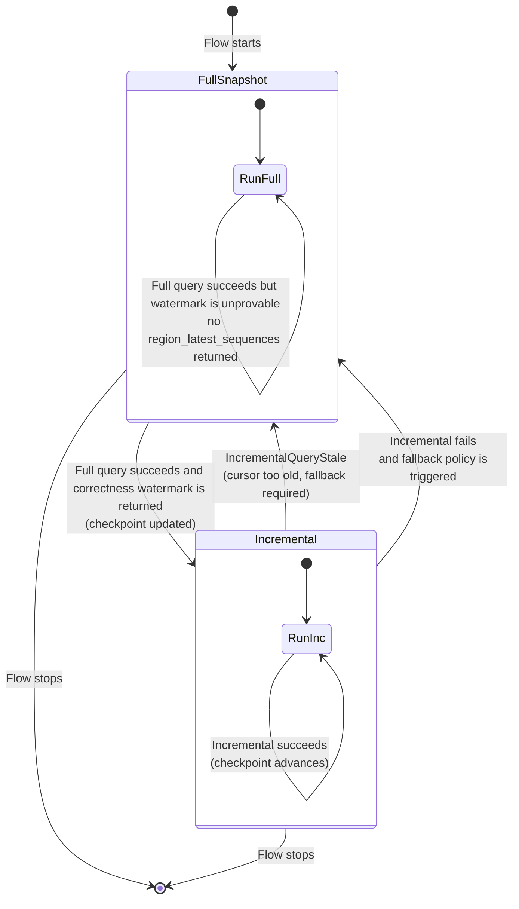

# Summary

This RFC proposes a correctness-first incremental query mode for Flow batching.
Flow queries can read only `seq > checkpoint` and advance checkpoints using per-region correctness watermarks.
When incremental reads are stale or correctness cannot be proven, Flow falls back to full recomputation.

# Motivation

Flow batching still needs to repeatedly compute old data in the same time window, so incremental query can improve Flow performance.

# Goals

1. Add opt-in incremental reads (`seq > given_seq`) for Flow.
2. Return per-region correctness watermarks for checkpoint advancement.
3. Keep existing query behavior unchanged unless explicitly enabled.
4. Define deterministic fallback for stale or unprovable incremental reads.

# Non-Goals

1. No business-schema changes (no synthetic watermark columns in result rows).
2. No global throughput optimization in v1 (correctness first).
3. No observational watermark output when correctness is unprovable.

# Proposal

## 1) Query options

Introduce three `QueryContext` extension keys:

- `flow.incremental_after_seqs`
- `flow.incremental_mode`
- `flow.return_region_seq`

These options are opt-in and only affect Flow incremental execution paths.

## 2) Scan mapping

When incremental mode is enabled:

- map `after_seq` to `memtable_min_sequence` (exclusive lower bound)
- keep existing snapshot upper-bound behavior (`memtable_max_sequence`)

If required incremental parameters are missing or invalid, return argument error.

## 3) Stale protection

Add dedicated stale error:

- `IncrementalQueryStale { region_id, given_seq, min_readable_seq }`

Behavior:

- if `given_seq < min_readable_seq`, return stale error
- if `given_seq == min_readable_seq`, query is valid and reads `seq > given_seq`
- if `given_seq > min_readable_seq`, query is also valid and reads `seq > given_seq`

## 4) Watermark return

Extend query metrics with optional per-region watermark map:

- `region_latest_sequences: Vec<(region_id: u64, latest_sequence: u64)>`

Rules:

- only terminal metrics of successful query can advance checkpoints
- for multi-region query, watermark must be complete map or absent
- if correctness is unprovable, business rows may return but watermark is absent

## 5) Flow state machine

Flow starts in full mode, then transitions:

1. Full query succeeds with correctness watermark -> enter incremental mode
2. Incremental query succeeds with correctness watermark -> advance checkpoint
3. Incremental stale/failure -> fallback to full mode
4. Full query without correctness watermark -> remain in full mode

### Fallback Policy

Fallback to full mode is deterministic and is triggered by any of the following:

1. `IncrementalQueryStale` is returned.
2. Incremental query fails with execution errors.
3. Incremental query succeeds but watermark is absent or incomplete for participating regions.

Policy behavior:

1. Do not advance any checkpoint in the failed/incomplete round.
2. Switch to full mode for the affected flow/window in the next round.
3. Return to incremental mode only after a full query succeeds with a complete correctness watermark map.

# Distributed and Compatibility Requirements

1. Distributed path must preserve region-level snapshot/read-bound semantics end-to-end.
2. `snapshot_seqs` transport and `flow.*` options must both be carried correctly.
   - `snapshot_seqs` means the per-region snapshot upper-bound map: `region_id -> sequence`.
3. New metrics fields must be backward-compatible (old clients ignore unknown fields).

# Rollout Plan

## Phase 1 (MVP, correctness first)

1. Add extension constants and parsing.
2. Add incremental scan mapping and stale detection.
3. Add watermark metrics field and terminal-watermark checkpoint update path.
4. Complete standalone and distributed passthrough.

## Phase 2 (performance and observability)

1. Improve batching key strategy with sequence/watermark context.
2. Optimize watermark serialization overhead.
3. Add metrics: incremental hit rate, fallback rate, fallback window size.

# Testing Plan

1. Unit tests for incremental bounds and stale detection.
2. Query-path tests for extension mapping and watermark semantics.
3. Flow integration tests for full->incremental->fallback transitions.
4. Distributed tests for end-to-end snapshot/watermark propagation.
5. Compatibility tests for old/new client-server combinations.

# Risks

1. Boundary semantic mismatch (`<` vs `<=`) may cause correctness bugs.
2. Incomplete distributed propagation can silently invalidate watermark safety.
3. Frequent fallback can reduce throughput before phase-2 optimizations.

# Alternatives

1. Put watermark into business rows (rejected: schema pollution).
2. Add new dedicated Flight message type in v1 (deferred to reduce scope).

# Conclusion

This plan enables a practical, correctness-first incremental path for Flow batching.
It reuses existing sequence scan capability, adds strict stale handling, and advances checkpoints only from correctness-proven per-region watermarks.
