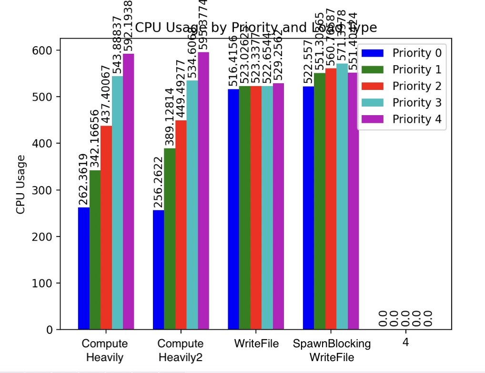

# Greptime Runtime

## Run performance test for different priority & workload type

```
# workspace is at this subcrate
cargo run --release -- --loop-cnt 500
```

## Related PRs & issues

- Preliminary support cpu limitation
  
  ISSUE: https://github.com/GreptimeTeam/greptimedb/issues/3685
  
  PR: https://github.com/GreptimeTeam/greptimedb/pull/4782

## CPU resource constraints (ThrottleableRuntime)


To achieve CPU resource constraints, we adopt the concept of rate limiting. When creating a future, we first wrap it with another layer of future to intercept the poll operation during runtime. By using the ratelimit library, we can simply implement a mechanism that allows only a limited number of polls for a batch of tasks under a certain priority within a specific time frame (the current token generation interval is set to 10ms).

The default used runtime can be switched by 
``` rust
pub type Runtime = DefaultRuntime;
```
in `runtime.rs`.

We tested four type of workload with 5 priorities, whose setup are as follows:

``` rust
impl Priority {
    fn ratelimiter_count(&self) -> Result<Option<Ratelimiter>> {
        let max = 8000;
        let gen_per_10ms = match self {
            Priority::VeryLow => Some(2000),
            Priority::Low => Some(4000),
            Priority::Middle => Some(6000),
            Priority::High => Some(8000),
            Priority::VeryHigh => None,
        };
        if let Some(gen_per_10ms) = gen_per_10ms {
            Ratelimiter::builder(gen_per_10ms, Duration::from_millis(10)) // generate poll count per 10ms
                .max_tokens(max) // reserved token for batch request
                .build()
                .context(BuildRuntimeRateLimiterSnafu)
                .map(Some)
        } else {
            Ok(None)
        }
    }
}
```

This is the preliminary experimental effect so far:



## TODO
- Introduce PID to achieve more accurate limitation.
