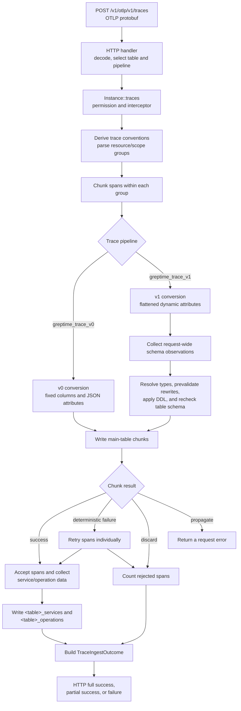

# OTLP trace ingestion

This directory owns the frontend orchestration for OTLP trace ingestion. It
starts after the HTTP server has decoded an OTLP protobuf request and ends after
the main trace table and its derived lookup tables have been written.

The responsibility is split across crates:

- `servers` decodes OTLP requests, parses spans, and converts spans into row
  insert requests;
- this module chunks requests, reconciles v1 schemas, writes rows, handles
  fallback, and accounts for accepted and rejected spans;
- `operator` creates or extends trace tables and performs the inserts.

## End-to-end path

### 1. HTTP ingress

The route is registered as `POST /v1/otlp/v1/traces` in
[`servers/src/http.rs`](../../../../servers/src/http.rs). The handler in
[`servers/src/http/otlp.rs`](../../../../servers/src/http/otlp.rs):

1. accepts protobuf OTLP payloads and rejects JSON content types;
2. selects the main table, defaulting to `opentelemetry_traces`;
3. resolves the requested pipeline; and
4. calls `OpenTelemetryProtocolHandler::traces`.

The trace converter currently accepts the internal `greptime_trace_v0` and
`greptime_trace_v1` pipelines. Their `PipelineWay` variants are defined in
[`pipeline/src/manager.rs`](../../../../pipeline/src/manager.rs).

### 2. Parse and chunk

[`Instance::traces`](../otlp.rs) checks the OTLP permission, runs the protocol
interceptor, derives the semantic-convention version, and parses the request.
The parser in
[`servers/src/otlp/trace/span.rs`](../../../../servers/src/otlp/trace/span.rs)
produces one `TraceSpanGroup` per resource/scope pair.

`ingest_trace_spans` in [`trace_ingest.rs`](trace_ingest.rs) splits the spans in
each group into owned chunks. `trace_ingest_chunk_size` defaults to 128; setting
it to 0 disables splitting. The option is defined in
[`service_config/otlp.rs`](../../service_config/otlp.rs).

### 3. Convert the selected trace model

| Model | Conversion and storage shape | Frontend behavior |
| --- | --- | --- |
| v0 | [`trace/v0.rs`](../../../../servers/src/otlp/trace/v0.rs) writes a fixed span schema and keeps span, scope, and resource attributes in JSON columns. | Converts and writes one chunk at a time through the legacy log insertion path. |
| v1 | [`trace/v1.rs`](../../../../servers/src/otlp/trace/v1.rs) flattens OTLP attributes into dynamic columns and records the value types seen in each chunk. | Scans chunks one at a time to build a request-wide schema plan, then materializes and writes one chunk at a time. |

Consequently, v1 chunks from one request can have different schemas: attribute
keys are data-dependent. The request-wide plan reconciles compatible column
observations across all chunks. The v0 main-table schema is comparatively fixed.

The v1 converter intentionally uses `write_column_unchecked` from
[`row_writer.rs`](../../../../servers/src/row_writer.rs) to preserve the original
dynamic values instead of making the first value in a chunk decide the column
type. `MultiTableData` later pads sparse rows to the completed chunk schema. The
frontend schema planner is the validation and reconciliation boundary.

## Trace v1 schema reconciliation

The v1 path performs these steps before the normal chunk writes:

1. Convert each chunk into a temporary `RowInsertRequest` and a
   `TraceBatchSchema` that records observed scalar types, sparse row presence,
   and binary logical types. Drop the dense request after collecting its
   lightweight schema observations.
2. Mark a chunk for span-only fallback if one column contains both raw OTLP
   bytes and arrays or key-value lists encoded as JSONB. Both use protobuf
   `BinaryValue`, but a Greptime column cannot represent both logical schemas.
   Other compatible columns in that chunk still contribute observations.
3. Aggregate the compatible observations into `TraceRequestSchema` and
   compare them with the existing table schema and the fixed types in
   [`trace_semconv.rs`](trace_semconv.rs).
4. Select a stable target type. Existing table types are authoritative when the
   incoming values can be coerced. New columns use all remaining request
   observations.
   The supported existing-column widening is `Int64` to `Float64`.
5. Use `prepare_trace_column_rewrites` in
   [`trace_types.rs`](trace_types.rs) to precompute every coercion without
   mutating rows. If a coercion cannot be prepared, remove only that column's
   observation from that chunk; unrelated columns can still contribute to DDL.
6. Create the table or add missing columns with `ensure_trace_table_on_demand`,
   and widen planned numeric columns. The implementation is in
   [`operator/src/insert.rs`](../../../../operator/src/insert.rs).
7. Read and plan against the table schema again after DDL to account for
   concurrent creates or alters. Then rematerialize, rewrite, and write one
   chunk at a time. If the schema does not converge, affected chunks use the
   per-request reconciliation path.

This ordering keeps conversion failures atomic: rows are not partly rewritten,
and an invalid column observation is not added to the table before that chunk
falls back.

## Writes, fallback, and accounting

The normal path writes a whole chunk first. `classify_trace_chunk_failure` in
[`trace_ingest.rs`](trace_ingest.rs) determines the next action:

| Reaction | Behavior |
| --- | --- |
| `RetryPerSpan` | Retry each span independently. Successful spans are accepted; deterministic per-span failures are rejected. A v1 chunk with incompatible raw-binary and JSONB values starts here without attempting a chunk write. |
| `DiscardChunk` | Do not retry the chunk at span granularity. Count every span in the chunk as rejected. |
| `Propagate` | Return the error for retryable or ambiguous failures instead of reporting a partial success. |

Accounting follows the main-table write:

- a span is accepted only after its main-table insert is confirmed;
- only accepted spans contribute service and operation rows;
- auxiliary rows are deduplicated and written afterwards to
  `<main_table>_services` and `<main_table>_operations`;
- an auxiliary-table failure adds failure detail but does not change the
  accepted or rejected span counts; and
- failure details are bounded before they are folded into `TraceIngestOutcome`.

Finally, the HTTP handler returns:

- full success when there are no rejected spans or failure details;
- OTLP partial success when spans were rejected or auxiliary/fallback details
  were recorded; or
- HTTP `400 Bad Request` when no span was accepted and at least one was
  rejected.

A propagated error bypasses that outcome and fails the request.

## Code map

| Area | Entry point |
| --- | --- |
| HTTP route and response mapping | [`servers/src/http/otlp.rs`](../../../../servers/src/http/otlp.rs) |
| Frontend protocol handler | [`instance/otlp.rs`](../otlp.rs) |
| Chunking, v1 planning, writes, fallback, accounting | [`trace_ingest.rs`](trace_ingest.rs) |
| Reconciliation decisions and atomic value rewrites | [`trace_types.rs`](trace_types.rs) |
| Semantic-convention fixed types | [`trace_semconv.rs`](trace_semconv.rs) |
| OTLP span parsing | [`servers/src/otlp/trace/span.rs`](../../../../servers/src/otlp/trace/span.rs) |
| v0 and v1 row conversion | [`servers/src/otlp/trace`](../../../../servers/src/otlp/trace.rs) |
| Trace-aware table creation and inserts | [`operator/src/insert.rs`](../../../../operator/src/insert.rs) |
