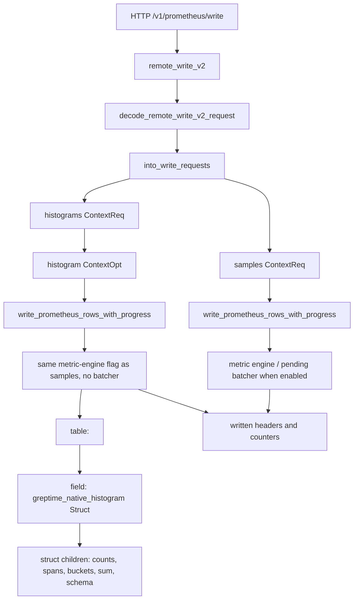

# Prometheus Remote Write

This module decodes Prometheus remote write requests and converts them into
Greptime row insert requests.

## Remote Write V2

Remote write v2 enters through `remote_write_v2` in
`src/servers/src/http/prom_store.rs`.

The conversion step splits one v2 request into two `ContextReq`s:

- samples keep the existing sample table name and can use the metric-engine
  physical table path and pending rows batcher;
- native histograms keep the existing metric table name.

Native histogram rows follow the same metric-engine switch as samples. They do
not use the pending rows batcher yet because the batcher assumes the classic
timestamp + Float64 value + string tags shape.

Each histogram row stores `greptime_native_histogram` as one Struct field:

- common scalar children: `schema`, `zero_threshold`, `sum`, `reset_hint`,
  `start_timestamp`;
- count children: `count_u64` / `zero_count_u64` or `count_f64` / `zero_count_f64`;
- list children for custom values, spans, and positive/negative buckets;
- original Prometheus labels as Greptime tags.

The v2 response always reports written sample, histogram, and exemplar counts in
Prometheus remote-write headers. Exemplars are currently ignored and reported as
zero.
