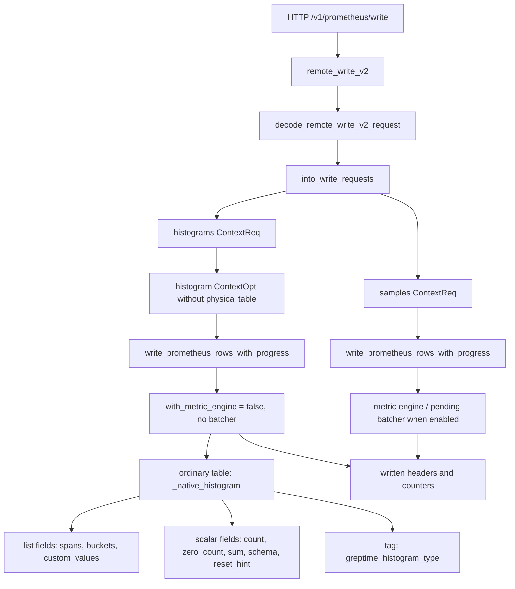

# Prometheus Remote Write

This module decodes Prometheus remote write requests and converts them into
Greptime row insert requests.

## Remote Write V2

Remote write v2 enters through `remote_write_v2` in
`src/servers/src/http/prom_store.rs`.

The conversion step splits one v2 request into two `ContextReq`s:

- samples keep the existing sample table name and can use the metric-engine
  physical table path and pending rows batcher;
- native histograms are written to ordinary `<metric>_native_histogram` tables.

Native histogram rows intentionally do not use metric-engine physical-table
routing. Metric-engine physical tables cannot store the native histogram list
schema, so histogram conversion drops physical-table routing from the histogram
`ContextOpt`, and the HTTP write path calls the shared writer with
`with_metric_engine = false` and no batcher.

Each histogram row stores:

- common scalar fields: `schema`, `zero_threshold`, `sum`, `reset_hint`;
- count fields: `count_u64` / `zero_count_u64` or `count_f64` / `zero_count_f64`;
- list fields for custom values, spans, and positive/negative buckets;
- `greptime_histogram_type`, either `int` or `float`;
- original Prometheus labels as Greptime tags.

The v2 response always reports written sample, histogram, and exemplar counts in
Prometheus remote-write headers. Exemplars are currently ignored and reported as
zero.
